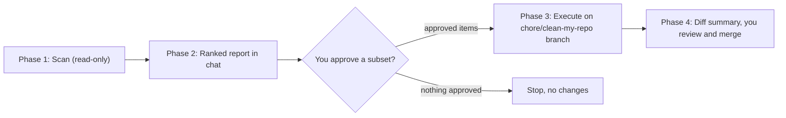

# clean-my-repo skill

## What I'm building

A single personal skill at `~/.cursor/skills/clean-my-repo/SKILL.md` (no scripts). Personal location because you want it available in *any* repo, not just this one. It is explicitly-invoked only (`disable-model-invocation: true`) since cleanup is a deliberate periodic action, not something to trigger from ambient context.

The skill encodes a strict 4-phase workflow with a hard approval gate between "analyze" and "act", matching your two decisions: report in chat, execute on a branch.

## The workflow the skill enforces

## Phase 1 — Scan (read-only, never edits)
Detect the repo's nature first (languages, build/config files, entry points, what is tracked vs git-ignored) so detection is agnostic, not research-repo-specific. Gather *evidence* for every candidate, not vibes:
- Dead/orphan files: not imported, referenced, or reachable from any entry point. Verified with a ripgrep reference search, evidence shown.
- Abandoned experiments / one-off dashboards / scratch scripts no longer wired into anything.
- Stale generated artifacts committed by mistake; duplicate or near-duplicate files.
- Naming issues: vague or misleading names (`utils`, `tmp`, `final_v2`, `untitled`), names that misrepresent contents.
- Structure issues: flat directories that should be grouped; files in the wrong folder; missing obvious subfolders.

Guardrails baked into the skill so it stays safe and agnostic:
- Never flag from "not recently modified" alone; require a real reference/usage search.
- Don't propose nuking intentional files: configs, lockfiles, CI, LICENSE, `.gitignore`, `AGENTS.md`, etc.
- Respect `.gitignore`: large generated/data dirs (here `data/`, `outputs/`) are flagged for awareness, never deleted blindly. Untracked/uncommitted files are surfaced separately, not deleted.
- This is cleanup only — no functionality changes, refactors, or debugging.

## Phase 2 — Ranked report in chat
Plain markdown grouped by category, each item with: path, what it is, why flagged, evidence (the search/result), recommended action (delete / rename / move), confidence, and risk. Severity tiers:
- P0 Safe to remove (clearly unreferenced)
- P1 Likely dead (verify one thing first)
- P2 Organization / renaming / restructure
- P3 Nice-to-have polish

## Phase 3 — Approval gate + execution on a branch
- Do nothing until you approve, and you can approve a subset.
- Create/switch to `chore/clean-my-repo` and apply only approved items there.
- Use git-native ops: `git rm`, `git mv` (reversible, preserves history).
- On rename/move, update every reference so nothing breaks; if there are tests, run them.
- If structure changed, update `README` / `AGENTS.md` references in the same pass.

## Phase 4 — Hand off
Print a diff summary (`git status` + `git diff --stat`) and tell you to review the branch and merge. The skill never merges or pushes.

## File
- `[~/.cursor/skills/clean-my-repo/SKILL.md](~/.cursor/skills/clean-my-repo/SKILL.md)` — frontmatter (`name`, `description` with WHAT+WHEN trigger terms, `disable-model-invocation: true`) plus the workflow above. Kept well under 500 lines, instruction-driven (no helper scripts) so it works across any language/stack.

## Why these choices
- Personal over project: portability across all your repos (your explicit "agnostic" requirement).
- Instruction-only, no scripts: cross-language dead-code detection via scripts is brittle; agent + ripgrep + git evidence generalizes better and needs zero maintenance.
- Branch + git-native: your chosen safety model — nothing is irreversible, and you review a clean diff before anything lands on `main`.