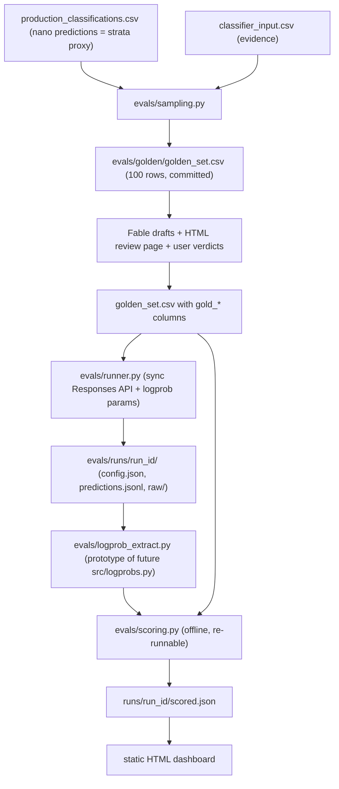

# Golden-Set Evaluation Harness

## STATUS (source of truth — update after every PR merge / pivot)

Last updated: **2026-07-12** (rename in flight: public CLI/module `run-classification` / `evals/classification.py`; Pass A auto-bank still default. Next = Stage 8 paid 9-cell from `main` after merge.)

| Field | Value |
|-------|--------|
| **Last merged** | PR **#26** — Pass A auto-bank default on `main` (stable `pass_a_banks/<model>/`, `--rerun-pass-a` / `--pass-a-from` escapes, `matrix` without reuse flag). Prior: PR **#25** Stage 8 science stack. |
| **Open now** | PR **#23** (`cursor/eval-dashboard-langsmith-ux-0263`) — separate LangSmith UX branch (do not delete). Rename branch `cursor/rename-two-pass-to-classification-c7d5`. |
| **Working branch** | Rename branch → then `main` for paid Stage 8. |
| **Next** | **Stage 8** paid 9-cell from `main`: for each model, run three `run-classification --effort-b {low,medium,high} --require-stage8-cell` (first cell creates the Pass A bank; later efforts auto-reuse). Score with `--confidence-from-raw` and `--baseline`. Use `python -m evals matrix` for the command list. Then Stage 9 real dashboard → Stage 10 report. |
| **Gold labels** | Fable `draft_*` = provisional gold **accepted for the paid Stage 8 sweep** (user 2026-07-11; pivot 4; human review waived, `gold_verdict` stays 0/100 by design). No gold CSV edits this session. ONE full agent re-draft deferred to end of pipeline (pivot 5); all runs re-scored offline afterwards. |
| **Orchestration mode** | Plan + this STATUS block = continuity. Fresh implementer chat per PR. Thin orchestrator chat for orientation only (no stage implementation dumps). |
| **Architecture reminder** | Pass A/B classification is COMMITTED for production promotion (pivots 7–8). Pass A is banked once per model across Pass B effort arms (science invariant). `src/` classifier is still historically one-pass. Banked single-pass runs are reference points only. Do **not** start `src/` promotion until Stage 8–9 insights land. |
| **Kill-list (landed)** | Pass A reuse; binary top_logprobs=2 + both candidates; Pass B isolating metrics; score `--baseline` + dashboard vs_baseline; ECE/selective/reliability; fixture Pass A invariant; refuse partial confidence; deprecate single-pass `run` guidance; `matrix` helper; dry-run output estimate; finalist mean±range. |

### Done

| PR | Stage | Branch | Notes |
|----|-------|--------|-------|
| #11 | 0+1 scaffolding + sampling | `eval-harness/stage-0-scaffolding` | Merged |
| #12 | 2 gold labeling drafts + review UI | `eval-harness/stage-2-gold-labeling` | Drafts committed; human gold still open |
| #13 | 3 sync runner + run records | `eval-harness/stage-3-runner` | Merged; banked baseline runs in `evals/runs/` (nano none/medium/high) |
| #14 | 4 two-pass prompts | `two-pass/stage-1-prompts` | Merged |
| #15 | 5 two-pass implementation | `two-pass/stage-2-implementation` (deleted) | Merged 2026-07-07; both `cursor[bot]` resume-invariant threads resolved (fix `705af2c` is in the merge) — no follow-up code needed |
| #17 | 6 logprob extraction | `eval-harness/stage-6-logprob-extract` (deleted) | Merged 2026-07-07 (`9caaa3f`), Bugbot clean. Gate evidence: Q2 tokenization pinned (decision-token index varies 34–44, structural location mandatory; byte reconstruction exact on 100/100 banked rows); Q3 `valid_mass` ≥ 0.999998 everywhere; Q5 fixtures composed from 6 decision tokens, zero company text. NOTE for Stage 7 calibration: 4/100 banked rows sampled the MINORITY token (verdict ≠ argmax, e.g. chosen 1 at p₁=0.28; `chose_minority` fixture pins one). **Locked (pivot 6):** sampled digit = prediction; logprob confidence describes certainty about that choice, never argmax substitution. |
| #16 | 7 batch parity + scorer | `eval-harness/stage-7-parity-scorer` | Merged by user 2026-07-07. Gate Q4 PASS (batch honors top_logprobs/effort/temperature, identical logprob shape). Banked nano baselines scored + committed (binary 93/93, subclass 41 none / 66 high / 77 medium). Calibration seam left data-only; wired in #18. |
| #18 | 7 calibration wire-up | `eval-harness/calibration-wireup` (deleted) | Merged by user 2026-07-08. `score --confidence-from-raw` runs the Stage 6 extractor over `raw/` and feeds chosen-digit confidence (pivot 6) into the scorer's external-mapping seam (scoring.py still never imports logprob_extract; the CLI is the connector). Verified on banked none_r1: ECE 0.077 (n=100), all 4 minority-sampling rows below 0.5 confidence. |
| #19 | pre-8 latency capture | `eval-harness/latency-capture` | Merged by user 2026-07-08. Per-row wall-clock latency in run records + mean/p50/p95/max latency block in scored.json — the measured axis pivot 7 added for Stage 8. |
| #20 | Q3 parity resilience | `eval-harness/parity-report-resilience` | Squash-merged 2026-07-08 (`cb30187`). Batch timeout / missing-output no longer discard paid sync results; `batch_error` + forced FAIL + nonzero exit. |
| #21 | pivot 8 cost extrapolate | `eval-harness/cached-tokens-cost-extrapolate` | Merged 2026-07-09 (`72ceeee`). `cached_tokens` in runners; `cost_extrapolate.py` ladder in `scored.json`; `python -m evals report` → `cost_report.html`. Scale-up N default = alive+dead ≈ 41,076. |
| #22 | Stage 9 mock viewer + Stage 8 preflight | `eval-harness/dashboard` (deleted after #25) | Merged 2026-07-11 (`cc2052a`). LangSmith-light mock dashboard, locked `EVAL_MODELS`, `--allow-partial`, fixture isolation. |
| #24 | Stage 8 science blockers | `eval-harness/research-direction-fixes` (deleted after #25) | Merged into dashboard then to main via #25. Pass A bank, binary logprobs, Pass B metrics, calibration charts. |
| #25 | Science stack → main | `eval-harness/dashboard` (deleted) | Merged 2026-07-11 (`4644bf9`). Lands #22+#24 science contracts on `main` for the paid 9-cell sweep. |

### In progress

- **Stage 8 (paid, next from `main`):** `python -m evals matrix` then `run-classification` per cell (Pass A auto-banks once per model). Provisional `draft_*` gold accepted for this sweep.

### Pending (in order) — NEXT STEPS

1. **Stage 8** — paid locked 9-cell sweep from `main` with Pass A banked once per model; score `--confidence-from-raw [--baseline]`; cost axis uses measured two-pass cache rates (pivot 8). Banked single-pass nano runs = reference only. Provisional `draft_*` gold.
2. **Stage 9** — point the dashboard at real `scored.json` via `--runs`. Until Stage 8 lands: mock fixture default.
3. **Stage 10** — written report answering the three eval questions + model recommendation + `AGENTS.md`.
4. **After insights (NOT today):** plan two-pass + logprob promotion into `src/` for ~40k production (alive+dead). Gated on Stage 8–9.
5. **Pivot 5 (timing TBD):** final gold re-draft + offline re-score of all banked runs.

### Pivots locked (do not rediscover in chat)

1. **2026-07-06 single-call invalidated.** Reasoning models reject `temperature`; logprobs only at `reasoning.effort=none`. Replacement: [two_pass_split_reasoning_classifier_9c1f4e20.plan.md](two_pass_split_reasoning_classifier_9c1f4e20.plan.md) — Pass A binary @ effort=none + logprobs; Pass B family-constrained subclass+RAD @ effort=high.
2. **Q1 answered early from Stage 3 banked runs:** deliberation does not "collapse spread" — it forbids logprobs. Binary holds without reasoning (~93% vs Fable at none and high); 10-way subclass does not (~41% vs ~66%).
3. **Zero-family 0B semantics (user, 2026-07-06):** `0B` = traditional software that ships a meaningful AI feature augmenting the product (Notion-style transition signal). Not "AI-core that survived AI removal." AI-core misrouted via Pass A=0 should surface as `0A` + `boundary_disagreement`, not hide in `0B`.
4. **2026-07-07 human gold review waived (user).** Fable `draft_*` labels are the gold reference ("provisional gold"). Rationale: human judgment drifts from the prompted taxonomy, so human verdicts would NOT be apples-to-apples with production. Constraint: gold must stay architecture-independent — drafts were made by Fable **as an agent applying the monolith taxonomy** (Stage 2, pre-two-pass), NOT via any pipeline. Never regenerate gold through the two-pass pipeline itself (circular: would bias the benchmark toward the architecture under test and invalidate the banked single-pass baselines).
5. **2026-07-07 full gold re-draft deferred to end of pipeline (user).** Current Fable drafts stay the provisional reference through Stages 6–8. ONE full re-draft of all 100 rows — Fable as agent, applying the then-final taxonomy text (incl. pivot 3's 0B fix) to the same evidence text the evaluated models receive — happens only after the whole flow is built and every design decision is locked (post Stage 8 go/no-go), then every banked run is re-scored offline (`scoring.py` is re-runnable by design, so late re-scoring is cheap). Rationale: re-drafting is expensive; doing it before the design freezes risks paying twice after another pivot. Supersedes pivot 4's open zero-family-refresh question (folds into the final re-draft). Stage 8's go/no-go is read provisionally against current drafts and confirmed after the re-draft.
6. **2026-07-07 sampled output is the prediction (user).** For scoring and calibration, the model's **sampled output** (the digit token it actually emitted) is always the prediction/verdict. Never substitute logprob argmax when they disagree. Logprob-derived confidence (`p_one`, margin, etc.) is metadata about how sure the model was about the digit it chose, not a separate "correct answer." Applies to Pass A binary and any future logprob-scored fields. Closes the open calibration-target question flagged in Stage 6 (4/100 banked rows chose the minority token).
7. **2026-07-08 eval scope fixed at three questions; two-pass architecture is COMMITTED, not under test (user).** The two-API-call design is a commitment: logprob confidence requires a reasoning-free call and subclass accuracy requires reasoning, so one call can never give both. The former "go/no-go: does two-pass beat the single-pass baselines" framing is RETIRED. Banked single-pass runs remain as reference points, not as competitors that could kill the design. The eval suite answers EXACTLY three questions (maximum scope, user-locked):
   - **Q1 Calibration:** how correlated is logprob confidence with actual correctness (reliability, ECE, selective prediction)?
   - **Q2 Model selection:** which GPT-family model to use, compared on accuracy, confidence quality, cost, and latency (latency included as a learning objective for production practice, not a research need)?
   - **Q3 Implementation robustness:** do logprob extraction and Batch API parity work as intended — will the classifier work in production?

   Mapping from the old six gate questions: old Q2/Q3/Q5 (tokenization, valid_mass, fixtures) and old Q4 (batch parity) fold into new Q3 and are already evidenced (PR #17, #16). Old Q6 (token sizing/cost model) folds into new Q2. Old Q1 was answered during the pivot to two-pass. The Stage 10 report is restructured around the three questions. Consequence for Stage 8: it is now a MODEL/CONFIG SELECTION experiment on the committed two-pass architecture — sweep GPT-family models (e.g. nano, mini, and one larger if affordable) and the Pass B effort arm (medium vs high, per the 77%-vs-66% banked finding), measuring accuracy, calibration, cost, and latency. NOT a design validation against single-pass. Per-row latency capture landed in PR #19 (ready for Stage 8).
8. **2026-07-08 production cost extrapolation locked (user).** Implement now (own PR, before/alongside Stage 8), not deferred to Stage 9-only. Decisions:
   - **Scale-up N default:** alive + dead extractable ≈ **41,076** (`22,032` non-empty live evidence + `19,044` `scrape_targets_dead`). Named constants in `evals/config.py` allow toggling other Ns later; default is the combo.
   - **Architecture for cost projections:** COMMITTED **two-pass ONLY**. Do not project single-pass production costs as the primary path. `src/` remains historically one-pass; eval/cost math assumes two-pass. Banked single-pass runs stay reference points (pivot 7).
   - **Cache:** MUST capture `cached_tokens` in eval runners (match `src/downloader.py` Responses usage mapping). Measure cache rate from golden-set **two-pass** runs. Do **not** assume production's ~78% cache rate (pre-two-pass / different prompts).
   - **Feature shape:** reusable `evals/cost_extrapolate.py` writes a structured, interpretable block into `scored.json`; dashboard/report only renders it (immutable per-run artifact + pure viewer).
   - **Breakdown ladder:** (1) golden-set actual tokens + $ at sync list, (2) cache adjustment from measured rate, (3) batch 50% → production-equivalent $ on the golden 100, (4) scale × (N_prod / n_golden), (5) assumptions callout (N, cache source, batch discount, two-pass, reasoning billed inside output). Legacy runs without `cached_tokens` mark cache as unavailable — honest gaps, no invented hit rate.

### Agent workflow (how we run PRs 6–10)

- **Source of truth:** this STATUS + plan frontmatter todos + git/PR state. Never chat memory.
- **USER MERGES, ALWAYS (user rule, 2026-07-07).** Workers and orchestrators stop at merge-ready (tests green + Bugbot clean) and report. No agent squash-merges, pushes to main via PR merge, or closes PRs on its own. (Plan STATUS commits to main by the orchestrator remain allowed — that is the continuity mechanism.)
- **No baby commits (user rule 2026-07-07):** orchestrator batches STATUS/plan edits into one consolidated commit per milestone, or rides them on the active PR branch. No standalone md-only micro-commits to main.
- **Thin orchestrator:** orientation, kickoff prompts, STATUS/todo updates, course corrections written *here*. No full-stage coding.
- **Fresh worker per PR:** reads this file → implements only that PR's scope → opens/finishes PR → updates this STATUS → stops.
- **Subagents** for Bugbot / recon; parent keeps conclusions only.
- After any auto-summarization or drift: retire the chat, spawn fresh from this block.

### Handoff (2026-07-07, leaving long eval chat)

- Code on `two-pass/stage-2-implementation` is ahead of this plan's older "PR #13 open / Stage 4 pending" text; **trust the table above**.
- Immediate orchestrator job: (1) schedule human gold review, (2) spin a **fresh** Stage-6 worker (PR #15 already merged).

### Final implementer notes (do not undo)

Written 2026-07-07 by the retiring implementer, after verifying against
`gh pr list`, `git log`, and the golden CSV. Everything below is fact, not plan.

- **PR #15 is MERGED** (2026-07-07 22:29 UTC, merge `84a7755`). The branch is
  fully contained in `origin/main` (`git diff origin/main HEAD` is empty) and
  can be deleted. The two unresolved `cursor[bot]` comments on #15 (both
  "resume invariants omit fields") are already addressed by commit `705af2c`,
  which IS in the merge — do not re-fix; just resolve/ignore the threads.
- **This plan file's STATUS block is uncommitted working-tree state** on the
  (now-merged) Stage 5 branch. It must be committed to main or it dies with a
  branch cleanup. That commit is the orchestrator's first job.
- **Banked local runs** (`evals/runs/`, git-ignored, predictions committed
  nowhere): three complete 100-row single-pass nano baselines —
  `2026-07-05_..._medium_r1`, `2026-07-06_..._none_r1`, `2026-07-06_..._high_r1`.
  These are the Stage 8 comparison baselines and exist ONLY on this machine.
  The `none` run's `raw/` holds the logprob arrays Stage 6 needs for fixtures.
- **Stage 6 landmines (logprob extract on Pass A):** (a) Pass A output is ~6
  tokens; the `ai_native` value rides ON the `1` or `0` digit token — but the
  first token is typically `{"` with near-1.0 prob, so locate the value token
  structurally (JSON parse + char spans), never by index. (b) top_logprobs
  lists contain grammar-masked entries at exactly `-100.0` — treat -100 as
  masked sentinels, not real probabilities, when renormalizing over {0,1}.
  (c) The chosen token may be absent from its own top_logprobs list; merge
  `entry.{token,logprob}` into the candidate pool before renormalizing.
  (d) Use the banked `none_r1/raw/*.json` responses as free fixtures before
  spending anything.
- **Two-pass runner API** (merged, `evals/two_pass.py`): `python -m evals
  run-two-pass [--model --effort-b --repeat --limit --dry-run --run-id]`.
  Raw responses land as `raw/<cid>_a.json` / `<cid>_b.json` per row. A row is
  resumable-complete only at `status == "completed"`; parse failures are
  recorded as `parse_failed` and retried on resume.
- **Not yet written anywhere else:** the single-pass agreement numbers vs
  Fable drafts (binary ~93% at both none and high; subclass 41% at none vs
  66% at high) came from an ad-hoc analysis in the retired chat. The scripts
  were throwaway; Stage 7's scorer re-derives them properly from the banked
  runs. Do not hunt for a script.

---

## Course correction (2026-07-06): findings redirected stages 4-7

Stages 0-3 DONE (PR #11, #12, #13 merged); Stage 4 DONE (PR #14). Stage 5 open as PR #15. The Stage 3
runs answered gate questions early and **invalidated the single-call design**
the later stages assumed: reasoning models reject `temperature`, and logprobs
return only at `reasoning.effort=none` (Q1 answered: reasoning doesn't collapse
the spread — it forbids logprobs entirely). Binary ai_native survives without
reasoning (93% vs Fable at none AND high); 10-way subclass does not (41% vs
66%). The replacement architecture is the two-pass classifier
([two_pass_split_reasoning_classifier_9c1f4e20.plan.md](two_pass_split_reasoning_classifier_9c1f4e20.plan.md)):
Pass A binary at effort=none with logprobs, Pass B family-constrained
subclass+RAD at effort=high. Consequences for this plan:

The stages are renumbered below: the two-pass prompt and implementation work
become **Stage 4** and **Stage 5** of this plan (detailed in the two-pass plan),
and the original stages 4-9 shift to 6-10. Logprob extraction now targets Pass
A's binary-only output (near-single-token JSON) instead of locating decision
tokens inside the full 11-field blob. Experiments compare two-pass vs the
banked single-pass baselines instead of the original 4-model x effort matrix.

## Purpose

This is the GATE from [.cursor/plans/logprob_confidence_classifier_17f55781.plan.md](.cursor/plans/logprob_confidence_classifier_17f55781.plan.md): before any production pipeline changes, build a 100-company golden-dataset eval harness that (a) answers the six open gate questions, (b) benchmarks gpt-5.4-nano / gpt-5.4-mini / gpt-5.4 / gpt-5.5 on accuracy vs cost, and (c) validates whether `logprob_confidence` actually predicts correctness (calibration). *(2026-07-08, pivot 7: the six gate questions collapsed into three eval questions — calibration, model selection, implementation robustness — and the two-pass architecture is committed rather than under test. This paragraph kept for history; the pivot list above is authoritative.)*

## Locked design decisions (user-confirmed 2026-07-04)

- **Location**: top-level `evals/` package, built via sequential `eval-harness/stage-N-*` branches PR'd to `main` (see Execution workflow). All runner/experiment code self-contained; imports ONLY three read-only production-identity artifacts from `src/` — `ClassificationResult` ([src/schema.py](src/schema.py)), `format_user_message` ([src/formatter.py](src/formatter.py)), `load_system_prompt` ([src/builder.py](src/builder.py)). Their SHA-256 hashes are snapshotted into every run record. Nothing in `src/` is ever modified.
- **Sampling**: stratified on existing nano predictions x evidence-length terciles; live strand only (dead-cohort evidence doesn't exist yet — extension is a fast-follow after `run_extract_dead.py`).
- **Gold labels**: Fable (agent, in-session) drafts label + rationale + ambiguity flag per row; user reviews via a generated HTML review page and records verdicts in the CSV. No row is gold without human sign-off.
- **API mode**: sync Responses API for all eval runs; one 10-row Batch API parity smoke asserting logprob shape AND parameter honoring (temperature, reasoning effort, top_logprobs, include) vs identical sync rows.
- **Matrix**: staged — screen 4 models at reasoning=medium (1 repeat) -> reasoning-effort sweep (incl. none-vs-medium A/B) on the 1-2 frontier models -> 3 repeats on finalists for determinism variance.
- **Storage**: one directory per run, `evals/runs/<run_id>/` (`config.json`, `predictions.jsonl`, `raw/`). `run_id` = `<date>_<model>_<effort>_r<n>`.
- **Git**: commit golden labels/verdicts (org_uuid + labels, NO evidence text) and `scored.json` summaries; git-ignore `evals/runs/*/raw/`.
- **Dashboard**: static HTML under `data visualization/01_Presentation_Materials/`. **Aesthetic (locked 2026-07-10):** LangSmith/LangChain eval-kit light mode (airy whitespace, underline tabs, thin chart frames, score bars + latency pills, quiet synthetic banner). Do **not** reuse survivorship navy/Cormorant house style for this dashboard. Canvas mock: `~/.cursor/projects/.../canvases/eval-dashboard.canvas.tsx`.
- **Metrics v1**: per-axis accuracy (ai_native / subclass / rad), macro-F1, confusion matrices, paired-bootstrap CIs (10k resamples) on model deltas, cost per row from actual usage — plus calibration (reliability diagram + selective-prediction curve for logprob_confidence).

## Architecture

## Stages

**Stage 0 — Scaffolding.** Branch `eval-harness/stage-0-scaffolding` (see Execution workflow below). `evals/config.py` (models list, efforts, `TOP_LOGPROBS=15`, `temperature=0`, `max_output_tokens=8000`, bootstrap N, verified eval pricing table — [src/tokens.py](src/tokens.py) pricing is stale, evals carries its own), `evals/paths.py`, `python -m evals` CLI with `sample / run / score / report` subcommands. Gitignore `evals/runs/*/raw/`.

**Stage 1 — Sampling** (`evals/sampling.py`). Join production predictions + `classifier_input.csv`, filter non-empty `website_evidence`, stratify (min ~6 per subclass 1A-1G, remainder across 0A/0B/0C, crossed with evidence-length terciles), fixed seed, emit `evals/golden/golden_set.csv`.

**Stage 2 — Gold labeling.** Fable drafts `draft_ai_native / draft_subclass / draft_rad / draft_rationale / ambiguity_flag` per row; script renders HTML review page (evidence beside draft); user records `gold_verdict` + final labels in the CSV.

**Stage 3 — Runner** (`evals/runner.py`). Byte-identical production request (imported prompt/schema/formatter) + experimental params (`include=["message.output_text.logprobs"]`, `top_logprobs=15`, `reasoning={"effort":...}`, `temperature=0`). Tenacity retries. Writes run dir with config snapshot (model, effort, prompt/schema SHA-256, git commit, timestamp).

**Stage 4 — Two-pass prompts** (branch `two-pass/stage-1-prompts`). Decompose `prompts/system_classifier_prompt.txt` into `binary_gate_prompt.txt` (Pass A: binary-only few-shots, collapsed decision procedure) and family-parameterized `subclass_rad_prompt.txt` (Pass B: `{family_block}` for 1A-1G vs 0A-0C). Prose-only PR so the user reviews the taxonomy text itself; includes a 3-5 row live format smoke. Full mapping table in the [two-pass plan](two_pass_split_reasoning_classifier_9c1f4e20.plan.md).

**Stage 5 — Two-pass implementation** (branch `two-pass/stage-2-implementation`). `BinaryResult` + family-constrained `SubclassResult` schemas (with `boundary_disagreement`), the two-pass runner in `evals/`, cohort computed in code, offline tests. Depends on Stage 4's merged prompts and PR 3's run-dir conventions.

**Stage 6 — Logprob extraction** (`evals/logprob_extract.py`). Targets Pass A's binary-only output: byte-reconstruction with char spans, decision-token location, renormalization, top1/margin/entropy. Pins real tokenization (gate Q2), captures anonymized fixtures (gate Q5), records `valid_mass` (gate Q3). Prototype later promoted to `src/logprobs.py`.

**Stage 7 — Batch parity + scorer.** (a) 10 Pass-A rows via Batch API with identical params; assert logprob shape parity and parameter honoring vs sync (gate Q4). (b) `evals/scoring.py` (offline): all v1 metrics; calibration applies to Pass A binary confidence (pivot 6: sampled digit = verdict, logprob fields = confidence metadata only); reasoning-token usage sizes `MAX_OUTPUT_TOKENS` and the cost model (gate Q6). Writes `scored.json`.

**Stage 8 — Model/config selection experiment** (paid, outside sandbox, `keys/openai.env`). On the COMMITTED two-pass architecture (pivot 7): locked matrix = **nano / mini / luna × Pass B low / medium / high** (9 Stage-1 screens), then Stage-2 finalist repeats (Waiting + CLI in the dashboard until r2/r3 land); measuring accuracy, calibration, cost, and latency. NOT a design validation against single-pass — the banked nano none/medium/high runs in `evals/runs/` serve as reference points only. Per-row latency capture already landed in PR #19.

**Stage 9 — Dashboard.** Static HTML with **LangSmith-light** aesthetic (not survivorship navy/Cormorant): cost-vs-accuracy Pareto, per-axis metrics with CIs, confusion matrices, calibration plots, disagreement browser (evidence + gold + each model's answer/rationale). **Config filter required:** show/hide model×effort configs on multi-run charts (Pareto, leaderboard, confidence, latency) so the Stage-1 9-point screen stays readable. Match the canvas mock at `eval-dashboard.canvas.tsx` (underline tabs, toolbar filter strip, score bars, latency pills). Skeleton (`evals/dashboard_metrics.py` + `build_eval_dashboard.py` + mock fixture) lands on PR #22; real Stage 8 `scored.json` plugged in via `--runs` / `--scored` (no auto-discovery).

**Stage 10 — Wrap-up.** `evals/tests/` completeness, AGENTS.md updates, and a written report answering the three eval questions (pivot 7: calibration, model selection, implementation robustness) + the model recommendation — the artifact that unblocks the production promotion.

## Execution workflow: sequential stage PRs to main + Bugbot (locked 2026-07-04)

`evals/` is purely additive (never touches `src/`), so stages merge to `main` directly as small sequential PRs — no long-lived feature branch, no giant final diff. Repo is PUBLIC (`k-hanafi/ai-startups-taxonomy-research`), which reinforces the no-evidence-text commit policy.

Per-stage loop:
1. `git checkout main && git pull` -> cut `eval-harness/stage-N-<name>`.
2. Build the stage; `pytest` green locally.
3. Local Bugbot subagent pass on the branch diff BEFORE pushing (fast inner net).
4. Push, open PR (titles/bodies per the portfolio-git-messages skill).
5. GitHub Bugbot review on the PR (auto on open/push, or comment `bugbot run`); fix findings, re-review until clean.
6. Agent stops at merge-ready; the USER squash-merges (rule 2026-07-07 — agents never merge). After the user merges: delete branch, pull main, cut next stage branch.

Stage-to-PR mapping (grouped by risk; STATUS block above is authoritative):
- PR 1 — Stage 0 + 1: scaffolding, config, CLI, sampler (+ tests) — MERGED #11
- PR 2 — Stage 2: review-page generator + Fable draft labels (human gold still open) — MERGED #12
- PR 3 — Stage 3: sync runner + run records — MERGED #13
- PR 4 — Stage 4: two-pass prompts — MERGED #14
- PR 5 — Stage 5: two-pass schemas + runner + tests — MERGED #15
- PR 6 — Stage 6: logprob extraction + fixtures + tests (own PR: subtlest code, silent-failure risk)
- PR 7 — Stage 7: batch parity smoke + scorer
- PR 8 — Stage 8: experiment artifacts (scored summaries) + fixes exposed by real runs
- PR 9 — Stage 9: HTML dashboard
- PR 10 — Stage 10: gate report + AGENTS.md

## Success criteria

The three eval questions (pivot 7) have evidenced answers:

1. **Calibration** — measured verdict on how correlated logprob confidence is with actual correctness (reliability diagram, ECE, selective-prediction curve).
2. **Model selection** — a GPT-family model is chosen, with scored runs comparing accuracy, confidence quality, cost, and latency (with CIs) across the swept models and Pass B effort arms.
3. **Implementation robustness** — logprob extraction and Batch API parity are shown to work as intended (already evidenced by PR #17 and #16), so the classifier will work in production.

Plus: 100 gold rows carry Fable labels from the final end-of-pipeline re-draft (pivots 4–5; human sign-off waived 2026-07-07), and every banked run is re-scored offline against them.
