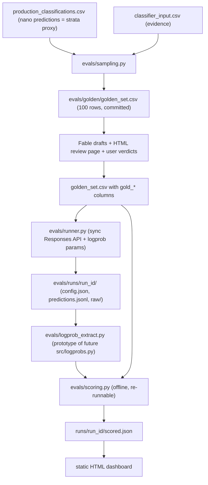

# Golden-Set Evaluation Harness

## STATUS (source of truth — update after every PR merge / pivot)

Last updated: **2026-07-07** (pivot 6 recorded: sampled output = prediction; logprobs = confidence metadata only). Long implementer chat retired; thin orchestrator + fresh workers own continuity from here.

| Field | Value |
|-------|--------|
| **Last merged** | PR **#17** — Stage 6 logprob extraction (merged 2026-07-07, squash `9caaa3f`, Bugbot clean) |
| **Open now** | none |
| **Working branch** | none — `two-pass/stage-2-implementation` deleted (local + origin) after merge; next worker cuts fresh from main |
| **Next** | Stage 7 PR #16 open (parity PASS, scorer + banked baselines scored). When merge-ready: USER merges. Scorer calibration uses sampled digit as verdict (pivot 6); wire `logprob_extract` confidence metadata (p_one, margin) without argmax substitution. Then Stage 8. |
| **Gold labels** | Fable `draft_*` = provisional gold (pivot 4; human review waived, `gold_verdict` stays 0/100 by design). ONE full agent re-draft deferred to end of pipeline, after all design decisions lock (pivot 5); all runs re-scored offline afterwards. |
| **Orchestration mode** | Plan + this STATUS block = continuity. Fresh implementer chat per PR. Thin orchestrator chat for orientation only (no stage implementation dumps). |

### Done

| PR | Stage | Branch | Notes |
|----|-------|--------|-------|
| #11 | 0+1 scaffolding + sampling | `eval-harness/stage-0-scaffolding` | Merged |
| #12 | 2 gold labeling drafts + review UI | `eval-harness/stage-2-gold-labeling` | Drafts committed; human gold still open |
| #13 | 3 sync runner + run records | `eval-harness/stage-3-runner` | Merged; banked baseline runs in `evals/runs/` (nano none/medium/high) |
| #14 | 4 two-pass prompts | `two-pass/stage-1-prompts` | Merged |
| #15 | 5 two-pass implementation | `two-pass/stage-2-implementation` (deleted) | Merged 2026-07-07; both `cursor[bot]` resume-invariant threads resolved (fix `705af2c` is in the merge) — no follow-up code needed |
| #17 | 6 logprob extraction | `eval-harness/stage-6-logprob-extract` (deleted) | Merged 2026-07-07 (`9caaa3f`), Bugbot clean. Gate evidence: Q2 tokenization pinned (decision-token index varies 34–44, structural location mandatory; byte reconstruction exact on 100/100 banked rows); Q3 `valid_mass` ≥ 0.999998 everywhere; Q5 fixtures composed from 6 decision tokens, zero company text. NOTE for Stage 7 calibration: 4/100 banked rows sampled the MINORITY token (verdict ≠ argmax, e.g. chosen 1 at p₁=0.28; `chose_minority` fixture pins one). **Locked (pivot 6):** sampled digit = prediction; logprob confidence describes certainty about that choice, never argmax substitution. |

### In progress

- **PR 7 / Stage 7** — parallel worker on `eval-harness/stage-7-parity-scorer`: `evals/scoring.py` (accuracy, macro-F1, confusion, bootstrap CIs, cost, reasoning-token sizing) + 10-row Batch parity smoke. Calibration consumes a per-row confidence value as plain data, NOT an import of PR 6's module. Workers stop at merge-ready (Bugbot clean); orchestrator sequences merges 6 then 7 (PR 7 rebases over 6's plan-file edits).

### Pending (in order)

PR 6 logprob extract → PR 7 batch parity + scorer → PR 8 paid two-pass experiments (provisionally scored vs current drafts) → **final gold re-draft + offline re-score (pivot 5)** → PR 9 dashboard → PR 10 gate report + `AGENTS.md`.

### Pivots locked (do not rediscover in chat)

1. **2026-07-06 single-call invalidated.** Reasoning models reject `temperature`; logprobs only at `reasoning.effort=none`. Replacement: [two_pass_split_reasoning_classifier_9c1f4e20.plan.md](two_pass_split_reasoning_classifier_9c1f4e20.plan.md) — Pass A binary @ effort=none + logprobs; Pass B family-constrained subclass+RAD @ effort=high.
2. **Q1 answered early from Stage 3 banked runs:** deliberation does not "collapse spread" — it forbids logprobs. Binary holds without reasoning (~93% vs Fable at none and high); 10-way subclass does not (~41% vs ~66%).
3. **Zero-family 0B semantics (user, 2026-07-06):** `0B` = traditional software that ships a meaningful AI feature augmenting the product (Notion-style transition signal). Not "AI-core that survived AI removal." AI-core misrouted via Pass A=0 should surface as `0A` + `boundary_disagreement`, not hide in `0B`.
4. **2026-07-07 human gold review waived (user).** Fable `draft_*` labels are the gold reference ("provisional gold"). Rationale: human judgment drifts from the prompted taxonomy, so human verdicts would NOT be apples-to-apples with production. Constraint: gold must stay architecture-independent — drafts were made by Fable **as an agent applying the monolith taxonomy** (Stage 2, pre-two-pass), NOT via any pipeline. Never regenerate gold through the two-pass pipeline itself (circular: would bias the benchmark toward the architecture under test and invalidate the banked single-pass baselines).
5. **2026-07-07 full gold re-draft deferred to end of pipeline (user).** Current Fable drafts stay the provisional reference through Stages 6–8. ONE full re-draft of all 100 rows — Fable as agent, applying the then-final taxonomy text (incl. pivot 3's 0B fix) to the same evidence text the evaluated models receive — happens only after the whole flow is built and every design decision is locked (post Stage 8 go/no-go), then every banked run is re-scored offline (`scoring.py` is re-runnable by design, so late re-scoring is cheap). Rationale: re-drafting is expensive; doing it before the design freezes risks paying twice after another pivot. Supersedes pivot 4's open zero-family-refresh question (folds into the final re-draft). Stage 8's go/no-go is read provisionally against current drafts and confirmed after the re-draft.
6. **2026-07-07 sampled output is the prediction (user).** For scoring and calibration, the model's **sampled output** (the digit token it actually emitted) is always the prediction/verdict. Never substitute logprob argmax when they disagree. Logprob-derived confidence (`p_one`, margin, etc.) is metadata about how sure the model was about the digit it chose, not a separate "correct answer." Applies to Pass A binary and any future logprob-scored fields. Closes the open calibration-target question flagged in Stage 6 (4/100 banked rows chose the minority token).

### Agent workflow (how we run PRs 6–10)

- **Source of truth:** this STATUS + plan frontmatter todos + git/PR state. Never chat memory.
- **USER MERGES, ALWAYS (user rule, 2026-07-07).** Workers and orchestrators stop at merge-ready (tests green + Bugbot clean) and report. No agent squash-merges, pushes to main via PR merge, or closes PRs on its own. (Plan STATUS commits to main by the orchestrator remain allowed — that is the continuity mechanism.)
- **Thin orchestrator:** orientation, kickoff prompts, STATUS/todo updates, course corrections written *here*. No full-stage coding.
- **Fresh worker per PR:** reads this file → implements only that PR's scope → opens/finishes PR → updates this STATUS → stops.
- **Subagents** for Bugbot / recon; parent keeps conclusions only.
- After any auto-summarization or drift: retire the chat, spawn fresh from this block.

### Handoff (2026-07-07, leaving long eval chat)

- Code on `two-pass/stage-2-implementation` is ahead of this plan's older "PR #13 open / Stage 4 pending" text; **trust the table above**.
- Immediate orchestrator job: (1) schedule human gold review, (2) spin a **fresh** Stage-6 worker (PR #15 already merged).

### Final implementer notes (do not undo)

Written 2026-07-07 by the retiring implementer, after verifying against
`gh pr list`, `git log`, and the golden CSV. Everything below is fact, not plan.

- **PR #15 is MERGED** (2026-07-07 22:29 UTC, merge `84a7755`). The branch is
  fully contained in `origin/main` (`git diff origin/main HEAD` is empty) and
  can be deleted. The two unresolved `cursor[bot]` comments on #15 (both
  "resume invariants omit fields") are already addressed by commit `705af2c`,
  which IS in the merge — do not re-fix; just resolve/ignore the threads.
- **This plan file's STATUS block is uncommitted working-tree state** on the
  (now-merged) Stage 5 branch. It must be committed to main or it dies with a
  branch cleanup. That commit is the orchestrator's first job.
- **Banked local runs** (`evals/runs/`, git-ignored, predictions committed
  nowhere): three complete 100-row single-pass nano baselines —
  `2026-07-05_..._medium_r1`, `2026-07-06_..._none_r1`, `2026-07-06_..._high_r1`.
  These are the Stage 8 comparison baselines and exist ONLY on this machine.
  The `none` run's `raw/` holds the logprob arrays Stage 6 needs for fixtures.
- **Stage 6 landmines (logprob extract on Pass A):** (a) Pass A output is ~6
  tokens; the `ai_native` value rides ON the `1` or `0` digit token — but the
  first token is typically `{"` with near-1.0 prob, so locate the value token
  structurally (JSON parse + char spans), never by index. (b) top_logprobs
  lists contain grammar-masked entries at exactly `-100.0` — treat -100 as
  masked sentinels, not real probabilities, when renormalizing over {0,1}.
  (c) The chosen token may be absent from its own top_logprobs list; merge
  `entry.{token,logprob}` into the candidate pool before renormalizing.
  (d) Use the banked `none_r1/raw/*.json` responses as free fixtures before
  spending anything.
- **Two-pass runner API** (merged, `evals/two_pass.py`): `python -m evals
  run-two-pass [--model --effort-b --repeat --limit --dry-run --run-id]`.
  Raw responses land as `raw/<cid>_a.json` / `<cid>_b.json` per row. A row is
  resumable-complete only at `status == "completed"`; parse failures are
  recorded as `parse_failed` and retried on resume.
- **Not yet written anywhere else:** the single-pass agreement numbers vs
  Fable drafts (binary ~93% at both none and high; subclass 41% at none vs
  66% at high) came from an ad-hoc analysis in the retired chat. The scripts
  were throwaway; Stage 7's scorer re-derives them properly from the banked
  runs. Do not hunt for a script.

---

## Course correction (2026-07-06): findings redirected stages 4-7

Stages 0-3 DONE (PR #11, #12, #13 merged); Stage 4 DONE (PR #14). Stage 5 open as PR #15. The Stage 3
runs answered gate questions early and **invalidated the single-call design**
the later stages assumed: reasoning models reject `temperature`, and logprobs
return only at `reasoning.effort=none` (Q1 answered: reasoning doesn't collapse
the spread — it forbids logprobs entirely). Binary ai_native survives without
reasoning (93% vs Fable at none AND high); 10-way subclass does not (41% vs
66%). The replacement architecture is the two-pass classifier
([two_pass_split_reasoning_classifier_9c1f4e20.plan.md](two_pass_split_reasoning_classifier_9c1f4e20.plan.md)):
Pass A binary at effort=none with logprobs, Pass B family-constrained
subclass+RAD at effort=high. Consequences for this plan:

The stages are renumbered below: the two-pass prompt and implementation work
become **Stage 4** and **Stage 5** of this plan (detailed in the two-pass plan),
and the original stages 4-9 shift to 6-10. Logprob extraction now targets Pass
A's binary-only output (near-single-token JSON) instead of locating decision
tokens inside the full 11-field blob. Experiments compare two-pass vs the
banked single-pass baselines instead of the original 4-model x effort matrix.

## Purpose

This is the GATE from [.cursor/plans/logprob_confidence_classifier_17f55781.plan.md](.cursor/plans/logprob_confidence_classifier_17f55781.plan.md): before any production pipeline changes, build a 100-company golden-dataset eval harness that (a) answers the six open gate questions, (b) benchmarks gpt-5.4-nano / gpt-5.4-mini / gpt-5.4 / gpt-5.5 on accuracy vs cost, and (c) validates whether `logprob_confidence` actually predicts correctness (calibration).

## Locked design decisions (user-confirmed 2026-07-04)

- **Location**: top-level `evals/` package, built via sequential `eval-harness/stage-N-*` branches PR'd to `main` (see Execution workflow). All runner/experiment code self-contained; imports ONLY three read-only production-identity artifacts from `src/` — `ClassificationResult` ([src/schema.py](src/schema.py)), `format_user_message` ([src/formatter.py](src/formatter.py)), `load_system_prompt` ([src/builder.py](src/builder.py)). Their SHA-256 hashes are snapshotted into every run record. Nothing in `src/` is ever modified.
- **Sampling**: stratified on existing nano predictions x evidence-length terciles; live strand only (dead-cohort evidence doesn't exist yet — extension is a fast-follow after `run_extract_dead.py`).
- **Gold labels**: Fable (agent, in-session) drafts label + rationale + ambiguity flag per row; user reviews via a generated HTML review page and records verdicts in the CSV. No row is gold without human sign-off.
- **API mode**: sync Responses API for all eval runs; one 10-row Batch API parity smoke asserting logprob shape AND parameter honoring (temperature, reasoning effort, top_logprobs, include) vs identical sync rows.
- **Matrix**: staged — screen 4 models at reasoning=medium (1 repeat) -> reasoning-effort sweep (incl. none-vs-medium A/B) on the 1-2 frontier models -> 3 repeats on finalists for determinism variance.
- **Storage**: one directory per run, `evals/runs/<run_id>/` (`config.json`, `predictions.jsonl`, `raw/`). `run_id` = `<date>_<model>_<effort>_r<n>`.
- **Git**: commit golden labels/verdicts (org_uuid + labels, NO evidence text) and `scored.json` summaries; git-ignore `evals/runs/*/raw/`.
- **Dashboard**: house-style static HTML only, under `data visualization/01_Presentation_Materials/`.
- **Metrics v1**: per-axis accuracy (ai_native / subclass / rad), macro-F1, confusion matrices, paired-bootstrap CIs (10k resamples) on model deltas, cost per row from actual usage — plus calibration (reliability diagram + selective-prediction curve for logprob_confidence).

## Architecture

## Stages

**Stage 0 — Scaffolding.** Branch `eval-harness/stage-0-scaffolding` (see Execution workflow below). `evals/config.py` (models list, efforts, `TOP_LOGPROBS=15`, `temperature=0`, `max_output_tokens=8000`, bootstrap N, verified eval pricing table — [src/tokens.py](src/tokens.py) pricing is stale, evals carries its own), `evals/paths.py`, `python -m evals` CLI with `sample / run / score / report` subcommands. Gitignore `evals/runs/*/raw/`.

**Stage 1 — Sampling** (`evals/sampling.py`). Join production predictions + `classifier_input.csv`, filter non-empty `website_evidence`, stratify (min ~6 per subclass 1A-1G, remainder across 0A/0B/0C, crossed with evidence-length terciles), fixed seed, emit `evals/golden/golden_set.csv`.

**Stage 2 — Gold labeling.** Fable drafts `draft_ai_native / draft_subclass / draft_rad / draft_rationale / ambiguity_flag` per row; script renders HTML review page (evidence beside draft); user records `gold_verdict` + final labels in the CSV.

**Stage 3 — Runner** (`evals/runner.py`). Byte-identical production request (imported prompt/schema/formatter) + experimental params (`include=["message.output_text.logprobs"]`, `top_logprobs=15`, `reasoning={"effort":...}`, `temperature=0`). Tenacity retries. Writes run dir with config snapshot (model, effort, prompt/schema SHA-256, git commit, timestamp).

**Stage 4 — Two-pass prompts** (branch `two-pass/stage-1-prompts`). Decompose `prompts/system_classifier_prompt.txt` into `binary_gate_prompt.txt` (Pass A: binary-only few-shots, collapsed decision procedure) and family-parameterized `subclass_rad_prompt.txt` (Pass B: `{family_block}` for 1A-1G vs 0A-0C). Prose-only PR so the user reviews the taxonomy text itself; includes a 3-5 row live format smoke. Full mapping table in the [two-pass plan](two_pass_split_reasoning_classifier_9c1f4e20.plan.md).

**Stage 5 — Two-pass implementation** (branch `two-pass/stage-2-implementation`). `BinaryResult` + family-constrained `SubclassResult` schemas (with `boundary_disagreement`), the two-pass runner in `evals/`, cohort computed in code, offline tests. Depends on Stage 4's merged prompts and PR 3's run-dir conventions.

**Stage 6 — Logprob extraction** (`evals/logprob_extract.py`). Targets Pass A's binary-only output: byte-reconstruction with char spans, decision-token location, renormalization, top1/margin/entropy. Pins real tokenization (gate Q2), captures anonymized fixtures (gate Q5), records `valid_mass` (gate Q3). Prototype later promoted to `src/logprobs.py`.

**Stage 7 — Batch parity + scorer.** (a) 10 Pass-A rows via Batch API with identical params; assert logprob shape parity and parameter honoring vs sync (gate Q4). (b) `evals/scoring.py` (offline): all v1 metrics; calibration applies to Pass A binary confidence (pivot 6: sampled digit = verdict, logprob fields = confidence metadata only); reasoning-token usage sizes `MAX_OUTPUT_TOKENS` and the cost model (gate Q6). Writes `scored.json`.

**Stage 8 — Experiments** (paid, outside sandbox, `keys/openai.env`). Two-pass over the golden set vs the banked single-pass baselines (nano none/medium/high already in `evals/runs/`); repeats on finalists for determinism variance; go/no-go on the two-pass design per the validation gate in the two-pass plan.

**Stage 9 — Dashboard.** House-style static HTML: cost-vs-accuracy Pareto, per-axis metrics with CIs, confusion matrices, calibration plots, disagreement browser (evidence + gold + each model's answer/rationale).

**Stage 10 — Wrap-up.** `evals/tests/` completeness, AGENTS.md updates, and a written gate report answering the gate questions + the model recommendation — the artifact that unblocks the production promotion.

## Execution workflow: sequential stage PRs to main + Bugbot (locked 2026-07-04)

`evals/` is purely additive (never touches `src/`), so stages merge to `main` directly as small sequential PRs — no long-lived feature branch, no giant final diff. Repo is PUBLIC (`k-hanafi/ai-startups-taxonomy-research`), which reinforces the no-evidence-text commit policy.

Per-stage loop:
1. `git checkout main && git pull` -> cut `eval-harness/stage-N-<name>`.
2. Build the stage; `pytest` green locally.
3. Local Bugbot subagent pass on the branch diff BEFORE pushing (fast inner net).
4. Push, open PR (titles/bodies per the portfolio-git-messages skill).
5. GitHub Bugbot review on the PR (auto on open/push, or comment `bugbot run`); fix findings, re-review until clean.
6. Agent stops at merge-ready; the USER squash-merges (rule 2026-07-07 — agents never merge). After the user merges: delete branch, pull main, cut next stage branch.

Stage-to-PR mapping (grouped by risk; STATUS block above is authoritative):
- PR 1 — Stage 0 + 1: scaffolding, config, CLI, sampler (+ tests) — MERGED #11
- PR 2 — Stage 2: review-page generator + Fable draft labels (human gold still open) — MERGED #12
- PR 3 — Stage 3: sync runner + run records — MERGED #13
- PR 4 — Stage 4: two-pass prompts — MERGED #14
- PR 5 — Stage 5: two-pass schemas + runner + tests — MERGED #15
- PR 6 — Stage 6: logprob extraction + fixtures + tests (own PR: subtlest code, silent-failure risk)
- PR 7 — Stage 7: batch parity smoke + scorer
- PR 8 — Stage 8: experiment artifacts (scored summaries) + fixes exposed by real runs
- PR 9 — Stage 9: HTML dashboard
- PR 10 — Stage 10: gate report + AGENTS.md

## Success criteria

All six gate questions have evidenced answers; every benchmarked model has scored runs with CIs and cost; calibration verdict on `logprob_confidence` is measured; 100 gold rows carry Fable labels from the final end-of-pipeline re-draft (pivots 4–5; human sign-off waived 2026-07-07).
