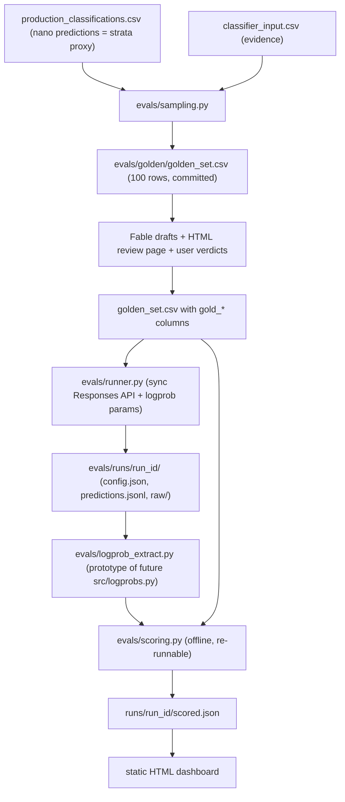

# Golden-Set Evaluation Harness

## Purpose

This is the GATE from [.cursor/plans/logprob_confidence_classifier_17f55781.plan.md](.cursor/plans/logprob_confidence_classifier_17f55781.plan.md): before any production pipeline changes, build a 100-company golden-dataset eval harness that (a) answers the six open gate questions, (b) benchmarks gpt-5.4-nano / gpt-5.4-mini / gpt-5.4 / gpt-5.5 on accuracy vs cost, and (c) validates whether `logprob_confidence` actually predicts correctness (calibration).

## Locked design decisions (user-confirmed 2026-07-04)

- **Location**: top-level `evals/` package, built via sequential `eval-harness/stage-N-*` branches PR'd to `main` (see Execution workflow). All runner/experiment code self-contained; imports ONLY three read-only production-identity artifacts from `src/` — `ClassificationResult` ([src/schema.py](src/schema.py)), `format_user_message` ([src/formatter.py](src/formatter.py)), `load_system_prompt` ([src/builder.py](src/builder.py)). Their SHA-256 hashes are snapshotted into every run record. Nothing in `src/` is ever modified.
- **Sampling**: stratified on existing nano predictions x evidence-length terciles; live strand only (dead-cohort evidence doesn't exist yet — extension is a fast-follow after `run_extract_dead.py`).
- **Gold labels**: Fable (agent, in-session) drafts label + rationale + ambiguity flag per row; user reviews via a generated HTML review page and records verdicts in the CSV. No row is gold without human sign-off.
- **API mode**: sync Responses API for all eval runs; one 10-row Batch API parity smoke asserting logprob shape AND parameter honoring (temperature, reasoning effort, top_logprobs, include) vs identical sync rows.
- **Matrix**: staged — screen 4 models at reasoning=medium (1 repeat) -> reasoning-effort sweep (incl. none-vs-medium A/B) on the 1-2 frontier models -> 3 repeats on finalists for determinism variance.
- **Storage**: one directory per run, `evals/runs/<run_id>/` (`config.json`, `predictions.jsonl`, `raw/`). `run_id` = `<date>_<model>_<effort>_r<n>`.
- **Git**: commit golden labels/verdicts (org_uuid + labels, NO evidence text) and `scored.json` summaries; git-ignore `evals/runs/*/raw/`.
- **Dashboard**: house-style static HTML only, under `data visualization/01_Presentation_Materials/`.
- **Metrics v1**: per-axis accuracy (ai_native / subclass / rad), macro-F1, confusion matrices, paired-bootstrap CIs (10k resamples) on model deltas, cost per row from actual usage — plus calibration (reliability diagram + selective-prediction curve for logprob_confidence).

## Architecture

## Stages

**Stage 0 — Scaffolding.** Branch `eval-harness/stage-0-scaffolding` (see Execution workflow below). `evals/config.py` (models list, efforts, `TOP_LOGPROBS=15`, `temperature=0`, `max_output_tokens=8000`, bootstrap N, verified eval pricing table — [src/tokens.py](src/tokens.py) pricing is stale, evals carries its own), `evals/paths.py`, `python -m evals` CLI with `sample / run / score / report` subcommands. Gitignore `evals/runs/*/raw/`.

**Stage 1 — Sampling** (`evals/sampling.py`). Join production predictions + `classifier_input.csv`, filter non-empty `website_evidence`, stratify (min ~6 per subclass 1A-1G, remainder across 0A/0B/0C, crossed with evidence-length terciles), fixed seed, emit `evals/golden/golden_set.csv`.

**Stage 2 — Gold labeling.** Fable drafts `draft_ai_native / draft_subclass / draft_rad / draft_rationale / ambiguity_flag` per row; script renders HTML review page (evidence beside draft); user records `gold_verdict` + final labels in the CSV.

**Stage 3 — Runner** (`evals/runner.py`). Byte-identical production request (imported prompt/schema/formatter) + experimental params (`include=["message.output_text.logprobs"]`, `top_logprobs=15`, `reasoning={"effort":...}`, `temperature=0`). Tenacity retries. Writes run dir with config snapshot (model, effort, prompt/schema SHA-256, git commit, timestamp).

**Stage 4 — Logprob extraction** (`evals/logprob_extract.py`). Byte-reconstruction with char spans, structural JSON location of decision tokens, renormalization, top1/margin/entropy per the locked schema in the logprob plan. Pins real tokenization (gate Q2), captures 2-3 anonymized fixtures (gate Q5), records `valid_mass` (gate Q3). This module is the prototype later promoted to `src/logprobs.py`.

**Stage 5 — Batch parity smoke** (gate Q4). 10 rows via Batch API with identical params; assert logprob array shape parity and parameter honoring (usage/reasoning tokens, extraction results) vs the same rows run sync.

**Stage 6 — Scorer** (`evals/scoring.py`, offline). All v1 metrics above; reasoning-token usage per effort sizes `MAX_OUTPUT_TOKENS` and the cost model (gate Q6). Writes `scored.json`; re-runnable without API calls.

**Stage 7 — Experiments** (paid, outside sandbox, `keys/openai.env`). (a) Screen 4 models at medium. (b) Effort sweep incl. none-vs-medium A/B on frontier models — answers gate Q1 with logprob-spread distributions. (c) 3 repeats on finalists. Ballpark < $30 total; dry-run cost printed before each paid step.

**Stage 8 — Dashboard.** House-style static HTML: cost-vs-accuracy Pareto, per-axis metrics with CIs, confusion matrices, calibration plots, disagreement browser (evidence + gold + each model's answer/rationale).

**Stage 9 — Wrap-up.** `evals/tests/` (sampler determinism, extraction golden fixtures, scorer on synthetic data), AGENTS.md updates, and a written gate report answering the six gate questions + the model recommendation — the artifact that unblocks the logprob pipeline plan.

## Execution workflow: sequential stage PRs to main + Bugbot (locked 2026-07-04)

`evals/` is purely additive (never touches `src/`), so stages merge to `main` directly as small sequential PRs — no long-lived feature branch, no giant final diff. Repo is PUBLIC (`k-hanafi/ai-startups-taxonomy-research`), which reinforces the no-evidence-text commit policy.

Per-stage loop:
1. `git checkout main && git pull` -> cut `eval-harness/stage-N-<name>`.
2. Build the stage; `pytest` green locally.
3. Local Bugbot subagent pass on the branch diff BEFORE pushing (fast inner net).
4. Push, open PR (titles/bodies per the portfolio-git-messages skill).
5. GitHub Bugbot review on the PR (auto on open/push, or comment `bugbot run`); fix findings, re-review until clean.
6. Squash-merge, delete branch, pull main, cut next stage branch (sequencing enforced by construction).

Stage-to-PR mapping (grouped by risk):
- PR 1 — Stage 0 + 1: scaffolding, config, CLI, sampler (+ tests)
- PR 2 — Stage 2: review-page generator + signed golden labels CSV
- PR 3 — Stage 3: sync runner + run records
- PR 4 — Stage 4: logprob extraction + fixtures + tests (own PR: subtlest code, silent-failure risk)
- PR 5 — Stage 5 + 6: batch parity smoke + scorer
- PR 6 — Stage 7: experiment artifacts (scored summaries) + fixes exposed by real runs
- PR 7 — Stage 8: HTML dashboard
- PR 8 — Stage 9: gate report + AGENTS.md

## Success criteria

All six gate questions have evidenced answers; every benchmarked model has scored runs with CIs and cost; calibration verdict on `logprob_confidence` is measured; 100 gold rows are human-signed.
