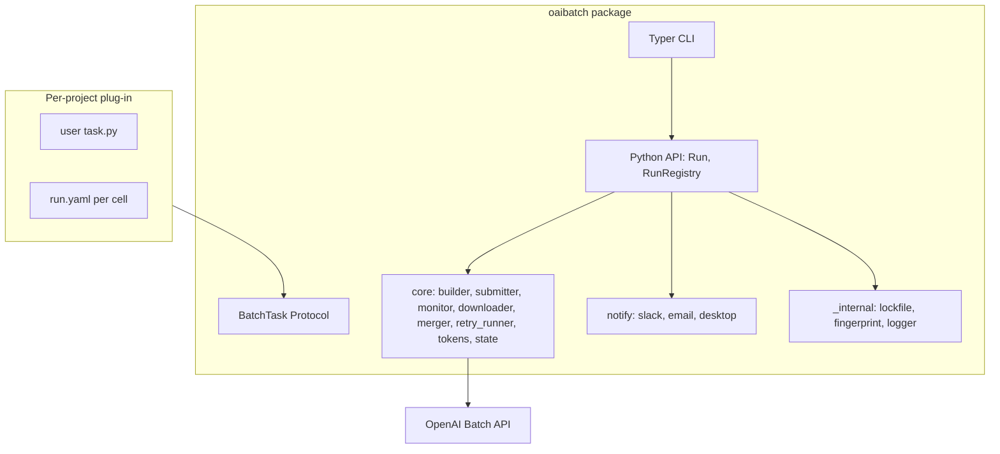

# oaibatch repo scaffolding

## Scope (narrowed from the original plan)

**This plan only lays the foundation.** The two research-project migrations and the actual code-lift from `llm_directness_experiment/src/` are deferred to a follow-up plan once the scaffolding is validated. Once this plan completes you will have:

- A public GitHub repo at `github.com/<user>/oaibatch`
- A pip-installable Python package whose CLI surface is fully visible (`oaibatch --help` shows every command) but every command body raises `NotImplementedError`
- A typed `BatchTask` Protocol and `Run` API surface that the future implementation phases will fill in
- A README that explains the project's vision, architecture, and roadmap clearly enough to be the public face of the repo

What this plan does **not** do:
- Lift any code out of [`/Users/k/Desktop/llm_directness_experiment/src/`](/Users/k/Desktop/llm_directness_experiment/src/) or [`/Users/k/Desktop/ai-native-startup-classification/src/`](/Users/k/Desktop/ai-native-startup-classification/src/)
- Migrate either research project
- Implement any CLI command body
- Publish to PyPI

Those are explicitly the next plan, after the scaffolding is reviewed.

## Architecture (preview, fully reflected in stubs)



The `BatchTask` Protocol is the central abstraction. Every subcommand operates on a `Run` (= one `(task, params)` cell) with an explicit `run_dir`.

## Repository layout

```
oaibatch/
├── pyproject.toml
├── README.md
├── LICENSE                   # MIT, 2026 <user>
├── .gitignore                # Python-flavored
├── src/oaibatch/
│   ├── __init__.py           # __version__, public re-exports
│   ├── cli.py                # Typer app, every subcommand registered
│   ├── api.py                # Run class (typed signatures, NotImplementedError bodies)
│   ├── task.py               # BatchTask Protocol, InputSource, Endpoint enum
│   ├── pricing.json          # per-model input/output rates, batch + cache discounts
│   ├── core/
│   │   ├── __init__.py
│   │   ├── builder.py        # build_request_body signatures for all 4 endpoints
│   │   ├── submitter.py      # upload_batch_file, create_batch, BillingLimitError
│   │   ├── monitor.py        # poll_all, submit_and_monitor signatures
│   │   ├── downloader.py     # download_completed, parse_result_line
│   │   ├── merger.py         # merge_batch_csvs, print_report
│   │   ├── retry_runner.py   # collect_failed, rebuild_jsonl
│   │   ├── tokens.py         # CostEstimate dataclass, estimate_cost, estimate_from_jsonl
│   │   └── state.py          # BatchRecord, PipelineState (run_dir-scoped)
│   ├── notify/
│   │   ├── __init__.py
│   │   ├── base.py           # Notifier Protocol
│   │   ├── slack.py
│   │   ├── email.py
│   │   └── desktop.py
│   └── _internal/
│       ├── __init__.py
│       ├── lockfile.py       # per-run flock
│       ├── fingerprint.py    # prompt + dataset hashing
│       └── logger.py         # rich + rotating file
├── tests/
│   ├── conftest.py
│   └── test_smoke.py         # imports + CLI --help
└── examples/
    ├── classification_responses_api/
    │   ├── task.py
    │   └── run.yaml
    ├── embeddings_corpus/
    │   ├── task.py
    │   └── run.yaml
    └── moderations_audit/
        ├── task.py
        └── run.yaml
```

## CLI surface (registered, all bodies raise NotImplementedError)

Every command exists at the CLI level so `oaibatch --help` is the public spec:

- Tier 1: `new`, `prepare`, `submit`, `status`, `download`, `retry`, `merge`, `run`, `test`
- Tier 2: `list`, `inspect`, `validate`, `cancel`, `cleanup`, `logs`, `estimate`, `cost`, `cache-report`
- Tier 3 (deferred bodies, but commands registered as `@app.command(hidden=True)`): `matrix`, `diff`, `notify`, `daemon`, `webhook serve`

## Key stub contents

- **`task.py`**: `BatchTask` Protocol, `Endpoint` enum (`responses | chat | embeddings | moderations`), `InputSource` Protocol, `Row` type alias.
- **`api.py`**: `Run.create(task, name, params, run_dir)`, `Run.load(run_dir)`, instance methods mirroring CLI verbs.
- **`core/state.py`**: `BatchStatus` Literal, `BatchRecord` dataclass (full lifecycle fields), `PipelineState` dataclass with atomic `save()` / `load(run_dir)` signatures.
- **`core/tokens.py`**: `CostEstimate` dataclass with `format_report()`; `estimate_cost(...)` and `estimate_from_jsonl(...)` signatures.
- **`pricing.json`**: starting model entries (`gpt-5.4-nano`, `gpt-5.4-mini`, `gpt-5.4`, `text-embedding-3-large`, `omni-moderation-latest`) with `input` / `output` / `batch_discount` / `cache_discount` keys.
- **`notify/base.py`**: `Notifier` Protocol with `on_run_completed(run)`, `on_run_failed(run, error)`.

## README sections

1. One-paragraph pitch ("oaibatch is a generalizable CLI for OpenAI's Batch API, designed to take a research task from CSV to merged results without rewriting infrastructure for each project")
2. Why this exists (the research-workflow duplication problem, with a brief example)
3. Status badge: "scaffolding (pre-alpha)"
4. Architecture mermaid diagram
5. Quickstart preview (the API as it will look) marked clearly as "planned, not yet implemented"
6. `BatchTask` Protocol example
7. Roadmap with the Tier 1/2/3 phasing
8. Install (editable from local checkout for now: `pip install -e .`)
9. Contributing pointer (placeholder)
10. License: MIT

## Validation steps before declaring done

1. `python -m pip install -e ~/Desktop/oaibatch` succeeds in a fresh venv
2. `oaibatch --help` lists every subcommand
3. `oaibatch prepare --help` shows expected flags
4. `pytest -q` passes the smoke test
5. `gh repo view <user>/oaibatch` shows the README rendering correctly with the mermaid diagram
6. The plan's deferred phases (1-6 of the original plan) are referenced from the README roadmap

## Open prerequisites

- GitHub username for `gh repo create` (will read from `gh api user --jq .login` at execution time)
- Confirm `gh` CLI is authenticated (`gh auth status`); if not, will surface that and ask to run `gh auth login`
