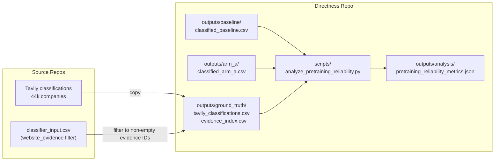

# Validating Pretraining-Derived Classifications Against Evidence-Grounded Labels

## Context

Arm A of the directness experiment classifies 269k startups using only the company name and address — the model relies entirely on pretraining knowledge. The ai-native-startup-classification repo independently classified 44,386 startups using live Tavily website crawls as enriched input. The overlap is **44,297 companies**, giving us a large paired sample to validate whether pretraining-only classifications are reliable.

Of the 44k companies the tavily pipeline attempted to crawl, only ~22k returned valid website content. The remaining ~22k were classified from Crunchbase text alone — functionally identical to the baseline arm's input — and therefore cannot serve as independent ground truth. We restrict the validation sample to the **evidence-only subset** (n=21,975): companies where Tavily returned non-empty crawl data, making their classifications genuinely grounded in external web evidence.

**Preliminary findings (evidence-only subset, n=21,965):**

| Comparison | Binary Agreement | Subclass Agreement | Mean Confidence |
|---|---|---|---|
| Baseline vs. GT | 91.1% | 66.2% | 3.39 |
| Arm A vs. GT | 83.0% | 59.1% | 1.52 |
| Tavily GT (reference) | — | — | 4.21 |
| Baseline vs. Arm A (same subset) | 86.2% | — | — |

The **8.1pp accuracy gap** (91.1% - 83.0%) between Baseline and Arm A against the same ground truth quantifies the marginal value of input features. Arm A's fallback rate in this subset is only 1.7%, confirming the model genuinely attempts classification from memory rather than refusing.

## Proposed Section Title

**"Pretraining Knowledge as a Classification Proxy: Validation Against Evidence-Grounded Labels"**

Alternative candidates to iterate on:
- "When Memory Meets Evidence: Validating Offline LLM Classifications"
- "Testing the Reliability of LLM Classifications Made Solely on Memorized Data" (user's original)

## Hypothesis and Statistical Design

### Research Question

How reliable are LLM classifications at varying levels of input richness, when validated against an evidence-grounded benchmark? Specifically: what is the marginal accuracy contribution of input features (Crunchbase text) beyond pretraining knowledge, and what further accuracy does live web evidence buy?

### Formal Hypotheses

- **H1 (Baseline Reliability):** The baseline classifier (Crunchbase text input) will show high agreement with evidence-grounded labels (Cohen's kappa > 0.75 on binary `ai_native`), validating that the 270k-company classification pipeline produces reliable measurements even without website evidence.

- **H2 (Pretraining Reliability):** Arm A (pretraining knowledge only) will show moderate agreement with evidence-grounded labels (Cohen's kappa > 0.50), but significantly lower than baseline — the gap quantifying the accuracy contribution of input features beyond memorized knowledge.

- **H3 (Information Rent):** Each step up in input richness (memory-only → Crunchbase text → Crunchbase + web evidence) will show significantly higher model confidence (Wilcoxon signed-rank tests). The confidence gap between levels quantifies the "information rent" — how much certainty each incremental data source purchases.

- **H4 (Confidence Discrimination):** Within each arm, higher self-reported confidence will predict higher agreement with ground truth. For Arm A, the meaningful signal is in the rare high-confidence tail (conf >= 4, ~2.3%): when the model claims to recognize a company from memory, it is correct at >90%. For Baseline, the relationship should be monotonic across the full range.

**Calibration note:** Confidence scales are not directly comparable across conditions. Each prompt places the model in a different epistemic state — Arm A explicitly communicates missing data (rational to report low confidence), Baseline provides moderate text (moderate confidence rational), Tavily provides rich evidence (high confidence rational). We assess discrimination (rank-ordering of reliability) within each condition independently, and measure the cross-condition gap as an "information rent" rather than a calibration comparison.

### Pairs Analyzed

| Pair | What it measures |
|---|---|
| Baseline vs. GT | Reliability of the Crunchbase-only pipeline (validates the paper's 270k classifications) |
| Arm A vs. GT | Reliability of pretraining knowledge alone (is memorized knowledge accurate?) |
| Delta (Baseline - Arm A) vs. GT | Marginal accuracy contribution of input features — the directness signal measured against ground truth |

### Metrics

| Metric | Computed for | Purpose |
|--------|---|---------|
| Raw agreement rate | Both pairs | Headline comparability |
| Cohen's kappa (binary + multiclass) | Both pairs | Chance-corrected agreement (controls for base-rate inflation) |
| McNemar's test (binary) / Stuart-Maxwell (multi) | Both pairs | Whether disagreements are directionally biased |
| Wilcoxon signed-rank test | Both pairs | Paired confidence shift significance |
| Mean/median confidence by arm | All three sources | Magnitude of the "information rent" at each input-richness level |
| Confidence distribution histograms | All three sources | Documents floor-clustering in Arm A vs. mid-range in Baseline vs. ceiling in Tavily |
| Per-tier agreement curve | Both pairs | Agreement rate at each confidence level (1-5) — tests within-arm discrimination |
| Stratification by fame quartile | Both pairs | Whether well-known firms show higher agreement (pretraining recall effect) |
| Base-rate decomposition | Both pairs | Separates "agreement because both say 0" (trivial) from "agreement on AI-native=1" (substantive) |
| Accuracy gap (Baseline - Arm A) | Derived | The directness signal measured against external ground truth |

### Ground Truth Definition

Only the **evidence-only subset** (n=21,975) qualifies as ground truth. These are companies where:
1. The Tavily crawler returned valid website content (non-empty `website_evidence` field)
2. The classifier had access to Crunchbase metadata AND live homepage evidence
3. The resulting classification is genuinely grounded in external data the model could not have memorized

The ~22k companies where Tavily found no crawl data are excluded — they were classified from Crunchbase text alone (short/long descriptions + categories), which is the same input basis as the directness experiment's baseline arm. Including them would be circular.

## Implementation

### Data Flow



### File Changes

1. **Copy ground truth data** — Copy `production_classifications.csv` from the tavily repo into `outputs/ground_truth/tavily_classifications.csv` in the directness repo. Also copy `classifier_input.csv` (or just the `org_uuid` + `website_evidence` columns) so the script can filter to evidence-only rows. Add `outputs/ground_truth/` to `.gitignore`.

2. **New analysis script** — `scripts/analyze_pretraining_reliability.py` implementing:
   - Load Baseline + Arm A + tavily ground truth
   - Filter to evidence-only subset (non-empty `website_evidence` from classifier_input)
   - Inner-join all three on CompanyID (expected n ~ 21,965)
   - Compute all metrics for BOTH pairs: Baseline vs. GT and Arm A vs. GT
   - Compute the accuracy gap (Baseline agreement - Arm A agreement) as the headline directness measure
   - Stratify by fame quartile (reuse existing `fame_quartiles.csv`)
   - Stratify by confidence tier within each arm
   - Base-rate decomposition (class-conditional agreement)
   - Output: `outputs/analysis/pretraining_reliability_metrics.json` + supporting CSVs

3. **README update** — Add a new major section after "Statistical Methods" documenting:
   - The validation experiment motivation
   - Hypothesis statements
   - Methodology (ground truth source, metrics)
   - Framed as extending the directness experiment's contribution

### Analysis Script Outputs

```
outputs/analysis/
├── ground_truth_validation_metrics.json        (headline summary: both pairs + gap)
├── ground_truth_agreement_by_axis.csv          (kappa, agreement per axis, per pair)
├── ground_truth_confidence_comparison.csv      (paired confidence stats, all three sources)
├── ground_truth_agreement_by_fame.csv          (stratified by fame quartile, per pair)
├── ground_truth_agreement_by_conf_tier.csv     (per-tier agreement for both arms)
├── ground_truth_base_rate_decomposition.csv    (class-conditional agreement)
├── confusion_baseline_vs_tavily__*.csv         (confusion matrices)
└── confusion_arm_a_vs_tavily__*.csv            (confusion matrices)
```

### Key Design Decisions

- **Why not import the full tavily pipeline?** The directness repo should remain self-contained. We copy only the final classification CSV and evidence metadata — the minimum artifacts needed for validation.
- **Why exclude companies without crawl data?** The ~22k companies where Tavily found no website content were classified from Crunchbase descriptions alone — the same input basis as the baseline arm. Using them as ground truth would be circular; they offer no independent signal.
- **Reuse fame quartiles?** Yes — `outputs/analysis/fame_quartiles.csv` already exists and stratification by fame tests whether pretraining reliability concentrates among well-known companies (expected: yes).
