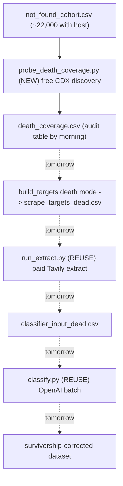
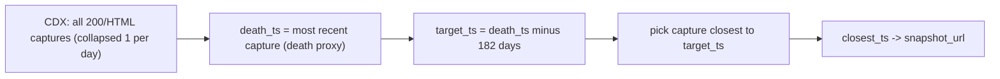

# Survivorship-Bias Wayback Cohort: Death-Anchored CDX Discovery

## Goal and scope

Remove survivorship bias from the current classification by recovering pre-death website snapshots for the companies Tavily could not extract, classifying them with the same pipeline, and merging them back.

**Tonight (this plan):** stand up the new branch, build the cohort, write the death-anchored CDX probe, and smoke-test it on a tiny sample. The deliverable is a verified probe plus a ready-to-paste `tmux` + `caffeinate` command. **You launch the full overnight scan yourself** in your own terminal for persistence; I do not start it in an agent terminal.

**Tomorrow (sketched, not executed):** audit coverage, then reuse the existing paid Tavily extract + `classify.py` to scrape and classify, then merge for a bias-corrected result.

## Confirmed cohort numbers

- Master cohort: 44,387 companies in [data/master_csv.csv](data/master_csv.csv)
- Survivors (Tavily got usable text): 22,032 (non-empty `website_evidence`)
- "Not found" complement (your target): 22,355
  - 9,428 with `website_alive=false` (truly dead/parked) -- genuine death proxy
  - 12,927 with `website_alive=true` (live today, Tavily extracted nothing) -- Wayback as a fallback
- Feedable to Wayback (has a host): ~22,002; ~21,995 unique hosts (host-dedup saves only 7 calls, so it is not worth implementing)
- This cohort is disjoint from the historical run's coverage (which only probed the 22,032 survivors in [wayback_machine/data/coverage_full.csv](wayback_machine/data/coverage_full.csv)), so there is no redundant work.

## Throughput: how fast "as fast as possible" actually is

The binding constraint is the Internet Archive, not our code. Confirmed against IA staff guidance and 2026 sources:

- `/cdx/*` is hard-capped at **60 requests/minute per IP**, averaged over a 5-minute window.
- Exceeding it returns HTTP 429. Ignoring 429s for more than ~1 minute triggers a **1-hour IP firewall block, doubling on repeat offenses**.
- There is no parallelism trick to beat this: every extra thread shares the same per-IP budget, so over-threading just earns a ban (which is strictly slower).

So "max throughput" means hugging that ceiling safely. The levers we use:

- **One CDX call per company.** The death-anchored selector needs the full capture history, which is a single query. The historical probe made up to two calls per company (window + "archived ever?"), so at the same rpm we are already roughly 2x fewer requests.
- **rpm = 58** (just under the 60 cap), the rate we pace to.
- **Concurrency = 24 workers behind one shared, non-blocking limiter.** The limiter reserves each slot then sleeps *outside* its lock, so workers genuinely run in parallel while slot spacing still caps the aggregate at 58/min. (An earlier version slept while holding the lock, which serialized workers; that is fixed.) Extra workers only fill request latency and can never exceed the cap.
- **Bounded retries** that fully honor 429 + `Retry-After` (mandatory to avoid the ban).

**Measured reality (tonight):** 58/min is only the *theoretical* floor (~22,000 / 58 ≈ 6.3h). In practice the Archive is the bottleneck: each full-history CDX query currently takes ~3-25s of server-side scan and IA appears to serialize requests per IP, so we measured ~**15/min regardless of concurrency (6, 24 — same)** — far below our own 58/min cap, with zero errors. That puts the full sweep around **~15-24h at the current IA speed**. Because the probe is fully resumable, an overnight run still yields a large, auditable sample by morning, and IA is often faster off-peak; if it speeds up, the 24 workers automatically pull more (up to 58/min) with no change.

## Pipeline reuse (what's new vs. reused)



## Death-anchored snapshot selection (the core new logic)

Today's probe in [wayback_machine/scripts/probe_coverage.py](wayback_machine/scripts/probe_coverage.py) hardcodes a single global anchor (`2023-03-14`). We need a per-company anchor derived from each site's own archive history:



Rules and fallbacks:

- Death proxy = the most recent archived 200/HTML capture. Rationale: we have no reliable external shutdown date, and the last successful capture is the best free signal the site stopped existing.
- Target = death minus ~182 days. Your rationale (avoid scraping the dead/parked tail) is exactly why the 6-month buffer helps; parked-page noise sits in the final months, which we skip.
- Selection = the most recent capture at or before target (>= 6 months before death). We never pick the parked/dead tail; we fall back to earlier only via the thin-history rule below.
- Thin-history fallback: if the entire archive history is shorter than 6 months (earliest capture is after target), take the earliest available capture and flag `thin_history=true`.
- No captures at all: `status=no_snapshots`, recorded but not retrievable.
- One request covers it: query the full history collapsed to one capture/day with a generous `limit`; only do a rare follow-up "last capture" call if the result looks truncated.

## Step-by-step (tonight)

### 1. Git: branch off main (merge-then-branch)

The historical pipeline branch is NOT actually merged. Merge into main is a clean fast-forward (verified: main is a direct ancestor, `0/0` divergence from `origin/main`). The plan-folder migration is currently uncommitted, so:

- `git stash push -u` (carry the `plan/` -> `plans/` migration across the checkout)
- `git checkout main && git merge --ff-only feat/wayback-historical-pipeline`
- `git checkout -b feat/removing-survivorship-bias`
- `git stash pop` (restore the migration onto the new branch)
- Pushing main to origin is optional and only if you want it remote tonight.

### 2. Build the cohort file

New script `wayback_machine/scripts/build_not_found_cohort.py` reads [outputs/tavilycrawl/processed/classifier_input.csv](outputs/tavilycrawl/processed/classifier_input.csv), keeps rows with empty `website_evidence` (~22,355), and writes `wayback_machine/data/not_found_cohort.csv` with `org_uuid,name,homepage_url,website_alive,founded_date`. Mirrors the existing [wayback_machine/scripts/extract_cohort.py](wayback_machine/scripts/extract_cohort.py). This step is free and offline.

### 3. Add a small shared CDX client

New `wayback_machine/cdx.py`: `to_host()` plus a rate-limited `cdx_get()` (shared global limiter that paces to the target rpm and freezes all workers on 429, honoring `Retry-After`). Used only by the new probe. We deliberately leave [wayback_machine/scripts/probe_coverage.py](wayback_machine/scripts/probe_coverage.py) and its test untouched (zero regression risk on code that is about to land on main); the minor duplication can be DRYed later.

### 4. Add the death-anchored probe

- Add `DEATH_LOOKBACK_DAYS = 182`, `CDX_FAST_RPM = 58`, and `CDX_DEATH_CONCURRENCY = 24` to [wayback_machine/config.py](wayback_machine/config.py).
- New `wayback_machine/scripts/probe_death_coverage.py` reads `not_found_cohort.csv`, runs one full-history CDX query per company via `cdx.py`, applies the death-anchored selection above, and appends to `wayback_machine/data/death_coverage.csv` (resumable: skip `status` in {ok, no_snapshots, no_host}; retry error rows). Output columns: `org_uuid,name,homepage_url,website_alive,founded_date,host,n_captures,first_ts,death_ts,target_ts,closest_ts,latest_url,target_url,earliest_url,days_from_target,days_before_death,lifespan_days,has_pre_death_snapshot,thin_history,status`. The three `*_url` columns are clickable Wayback viewer URLs (`web/{ts}/{homepage_url}`, no `id_`) for side-by-side auditing: `latest_url`=death_ts (parked/dead tail), `target_url`=closest_ts (our selected pre-death pick), `earliest_url`=first_ts (first capture). The raw `id_` byte URL fed to Tavily tomorrow is derived from the same `closest_ts` via `cohort.build_snapshot_url`. CLI: `--sample-size`, `--rpm` (default 58, hard cap 60), `--concurrency` (default 24), `--output`.

### 5. Smoke-test the selector

Build the cohort, then run `probe_death_coverage.py --sample-size 25` and eyeball: are `death_ts`, `target_ts`, and `closest_ts` sane (target ~6 months before death; closest near target)? Confirm output schema and resume behavior. Needs outbound network to `web.archive.org`.

### 6. Hand off the launch command (you run it)

Deliver the exact command for your tmux session, e.g.:

```bash
tmux new -s wayback
caffeinate -ims python3 wayback_machine/scripts/probe_death_coverage.py \
  --sample-size 0 --rpm 58 --concurrency 24 \
  --output wayback_machine/data/death_coverage.csv
# detach: Ctrl-b then d   |   reattach: tmux attach -t wayback
```

I will not start the full run myself.

## Tomorrow (after you audit `death_coverage.csv`)

1. Review feasibility: how many have `has_pre_death_snapshot=true` vs `thin_history` vs `no_snapshots`.
2. Build targets in a death mode (adapt [wayback_machine/scripts/build_targets.py](wayback_machine/scripts/build_targets.py) + `build_snapshot_url()` in [wayback_machine/cohort.py](wayback_machine/cohort.py)) -> `scrape_targets_dead.csv`.
3. Paid Tavily extract, reusing [wayback_machine/scripts/run_extract.py](wayback_machine/scripts/run_extract.py) unchanged with a budget cap (keeps methodology identical to the live + historical scrapes for a fair merge).
4. Build `classifier_input_dead.csv` (adapt [wayback_machine/scripts/build_classifier_input_2023.py](wayback_machine/scripts/build_classifier_input_2023.py)) and run `python classify.py run --data ...`.
5. Merge dead-cohort classifications with [outputs/production_csvs/production_classifications.csv](outputs/production_csvs/production_classifications.csv) into a survivorship-corrected dataset.

## Pre-run review (Bugbot + manual, before the full sweep)

Ran a Bugbot pass plus a manual coverage audit on the new code:

- **Fixed (high):** `RateLimiter.wait_turn` could fire requests inside a 429 back-off window because a freeze installed by another worker during its sleep was not re-checked. Now loops and re-waits until `_frozen_until` clears, so a 429 reliably halts all workers (avoids the IA firewall ban on an unattended run).
- **Validated `www.` handling (no change needed):** querying the bare host already captures the homepage under both `example.com/` and `www.example.com/`, because Wayback's SURT urlkey strips `www.` (shared key), while subdomains/subpaths get distinct keys and are correctly excluded. A `matchType=domain` variant was prototyped and reverted: it added only subdomains/deep paths (e.g. a subdomain captured months after the homepage died, which would corrupt the death proxy) at a heavier per-request cost. Confirmed on 4 hosts: bare-host homepage day counts == `bare_root ∪ www_root`.
- **Assessed low-risk, no change:** CDX `limit=20000` truncation (impossible at ~1 capture/day for startup-age domains; homepage SURT key also sorts first); and a kill-mid-write leaving a partial/duplicate row (output flushes per row, resume de-dupes on `org_uuid`).

## Notes / assumptions

- Tonight spends no money (CDX is free, unauthenticated). Tavily/OpenAI keys in `keys/` are only needed tomorrow.
- The probe is stdlib-only (no API key, no extra deps); the cohort builder uses pandas, already a dependency.
- New code lives under `wayback_machine/` and leaves the historical probe and its test untouched.
- Branch name proposed as `feat/removing-survivorship-bias`; say the word if you'd prefer a different name.
