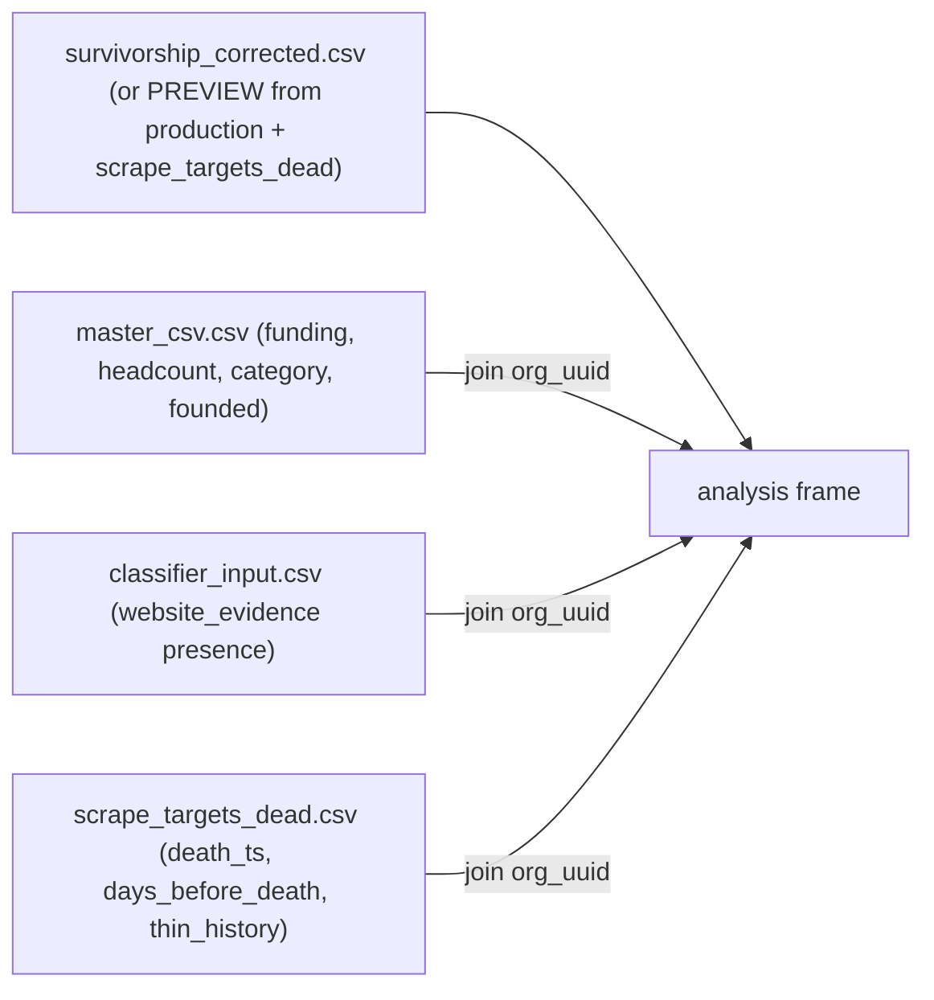

# Survivorship Insights Dashboard

Goal: turn the merged survivor-vs-dead dataset into a paper-grade findings dashboard that goes beyond "we removed survivorship bias" and tests *why* companies died, validating the RAD axis against a real-world outcome (mortality).

## Writing style (all dashboard prose)
Hard constraints on every word of rendered text (titles, descriptions, insight boxes, captions):
- No em dashes anywhere. Use periods, commas, colons, parentheses, or "and".
- Short, punchy sentences. Every word earns its place.
- Concise and straight to the point. No hedging filler, no academic bloat.
- Register: academic and paper-grade, but lean. Credible for a professor audience.
- Note: the existing dashboard builders are em-dash heavy. Do not copy their prose. Reuse their STYLE/layout only, rewrite all text.

## Agreed scope (from clarifying questions)
- **Inferential**: descriptive charts PLUS a logistic regression of survival on AI-nativeness/RAD/subclass, controlling for funding, age/era, and category, reported as odds ratios with 95% CIs.
- **Layered dead definition**: report the full not-extractable cohort AND a strict high-confidence-dead subset (`website_alive=false` AND not `thin_history`); show findings hold across both.
- **Build now** against the known schema; render a structurally accurate PREVIEW until the real classifications land.

## Architecture (mirror the existing summarize -> build split)
Follow the pattern of [build_survivorship_dashboard.py](data visualization/02_Analysis_Code/build_survivorship_dashboard.py) importing [summarize_death_coverage.py](wayback_machine/scripts/summarize_death_coverage.py): a pure-compute module returns a metrics dict; a thin builder renders HTML. This keeps the stats testable and the HTML dumb.

- New compute module: `data visualization/02_Analysis_Code/survivorship_analysis.py`. Assembles one analysis dataframe, computes all section metrics plus the regression, returns a JSON-able dict.
- New builder: `data visualization/02_Analysis_Code/build_survivorship_insights_dashboard.py`. Reuses the STYLE/SCRIPT/nav/insight-box house style from the existing survivorship builder; writes `data visualization/01_Presentation_Materials/survivorship_insights.html`.

## Data assembly (in survivorship_analysis.py)

Cohort flags on the frame:
- `survivor` = `evidence_source=="live"` AND non-empty `website_evidence`.
- `dead_full` = `evidence_source=="wayback_dead"`.
- `dead_strict` = `dead_full` AND `website_alive==false` AND `thin_history` false.
- `excluded` = live but empty evidence (~3k metadata-only orphans). Reported, not compared.

PREVIEW fallback: if `survivorship_corrected.csv` is absent, synthesize the same frame from `production_classifications.csv` tagging the 19,044 `org_uuid`s in `scrape_targets_dead.csv` as `wayback_dead` (verdicts are metadata-only placeholders). Builder shows a prominent "PREVIEW: dead verdicts not yet evidence-based" banner; it disappears once the real CSV exists.

## Dashboard sections (hypotheses -> charts)
- **0. Survivorship correction (H2)**: before/after global AI-native rate, subclass mix, RAD mix (survivor-only "biased" view vs corrected). Headline metric cards.
- **1. AI-nativeness vs survival (H1)**: AI-native rate survivor vs dead (full + strict side-by-side for robustness); subclass over/under-representation in the dead cohort (lift = dead share / survivor share). Framed neutrally: adaptation story vs hype-casualty story, data decides.
- **2. RAD as a survival predictor (H3, the crown jewel)**: mortality rate by RAD bucket and by subclass (1C/1G commoditizable vs 1A/1B/1E defensible). This validates the hand-designed RAD axis against an external outcome.
- **3. Dependency-trap quadrant (H4)**: mortality heatmap, funding bucket x RAD/AI-dependency.
- **4. Vertical commoditization (H5)**: top `category_list`/`category_groups_list` by AI-native mortality.
- **5. Temporal deaths (H6)**: deaths/month from `death_ts`, overlaid with major model-release markers, optionally split commoditizable vs defensible subclass. Labeled exploratory.
- **6. Inferential model**: statsmodels `Logit`, `died ~ ai_native + rad + subclass_group + log_funding + founding_era + category_group`. Odds-ratio forest plot with 95% CIs; report n + pseudo-R².
- **7. Methodology & robustness (H7/H8)**: metadata-only vs evidence flip rate; confidence (`conf_classification`) live vs wayback; thin-history sensitivity; explicit "not-found != dead" and evidence-recency-mismatch caveats.

## Dependencies
Add `statsmodels` (pulls scipy/numpy/patsy, already installed) under a new `analysis` optional-extra in [pyproject.toml](pyproject.toml) so the regression is reproducible without bloating the core pipeline deps.

## Verification
- `python3 .../survivorship_analysis.py` prints cohort sizes that reconcile to 44,387 (survivor + dead + excluded) and a regression summary with no NaN coefficients.
- Builder writes a self-contained HTML that opens with all Plotly charts rendering and the PREVIEW banner visible (pre-run) / absent (post-run).
- Re-running after the real `survivorship_corrected.csv` lands changes numbers but not structure.

## Out of scope
- The historical/March-2023 "AI-washing death rattle" cross-strand comparison (depends on the paused historical strand). Noted as a future direction only.
