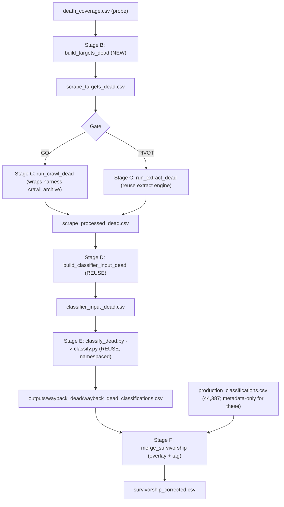

# Dead-Cohort Tavily Classification Pipeline (Production)

> **PLAN 2 of 2.** Prerequisite: the [demo harness plan] is merged and the GO/PIVOT
> methodology decision is made. This plan reuses the harness module
> `wayback_machine/tavily_archive_lab.py` as the per-company scrape worker, so it
> should branch off the merged harness branch.

## Goal

Move the full ~22k "Tavily not found" cohort from `death_coverage.csv` (the probe is filling it; ~93% of resolved rows are `ok`) through the **same** classifier as the live cohort, producing a survivorship-corrected dataset. All artifacts live in a workspace fully isolated from the finished modern run.

## Gating decision (from the demo harness)

- **GO** (archive crawl yields clean, multi-page, classifier-grade evidence): Stage B/C use the 5-page archive crawl (`if_` URLs + per-company scope), matching the modern methodology.
- **PIVOT** (crawl on the archive is noisy/incompatible): Stage B/C use single-page `id_` homepage extract; the 1-vs-5-page gap is documented as a paper limitation.

## Design principles

- **Reuse the classifier wholesale.** `classify.py` only reads `CLASSIFIER_INPUT_COLUMNS`; we feed a different `website_evidence`. Identical model + prompt + schema is what makes the comparison valid.
- **Total isolation via a namespaced workspace.** Every modern batch path derives from constants in [src/paths.py](src/paths.py) bound at import time. One env var (`CLASSIFY_NS=wayback_dead`) cascades to `state.py`, `builder.py`, `downloader.py` with no other `src` edits, routing state/batches/results/errors/output CSV under `outputs/wayback_dead/`. Nothing touches the finished modern run.
- **Leave the live + 2023 code byte-identical.** Add dead-suffixed CLIs beside them (same convention as `cdx.py` vs `probe_coverage.py`). `src/tavily_crawl.py` is reused, never modified.
- **Selection = all resolvable, thin flagged:** `status==ok` and non-empty `closest_ts`, every founding date, `thin_history` carried as a column.

## Data flow



## Steps

### Step 1 - New artifact paths

Add dead-suffixed paths to [wayback_machine/paths.py](wayback_machine/paths.py): `DEATH_COVERAGE_CSV`, `SCRAPE_TARGETS_DEAD_CSV`, `SNAPSHOTS_DEAD_JSONL`, `EXTRACT_STATE_DEAD_JSON`, `RUN_MANIFEST_DEAD_CSV`, `SCRAPE_PROCESSED_DEAD_CSV`, `CLASSIFIER_INPUT_DEAD_CSV`, `EXTRACT_DEAD_LOG` (+ crawl-variant names if GO).

### Step 2 - Stage B: dead targets (NEW)

New `wayback_machine/targets_dead.py` + CLI `wayback_machine/scripts/build_targets_dead.py`, modeled on [wayback_machine/targets.py](wayback_machine/targets.py): read `death_coverage.csv`, dedupe by `org_uuid` preferring `status==ok`, keep `status==ok` & non-empty `closest_ts` (no founded cutoff), carry provenance (`death_ts`, `days_before_death`, `thin_history`, `website_alive`).
- **GO:** emit the `if_` archive crawl URL + a per-company `select_paths` regex.
- **PIVOT:** emit the `id_` homepage `snapshot_url` via [wayback_machine/cohort.py](wayback_machine/cohort.py) `build_snapshot_url`.

### Step 3 - Stage C: paid scrape (REUSE)

- **GO:** new `wayback_machine/scripts/run_crawl_dead.py` (+ a `crawl_dead.py` runner) wrapping the harness `crawl_archive` worker with the same reliability harness as [wayback_machine/extract.py](wayback_machine/extract.py) (resumable JSONL, sliding-window limiter, outage loop, SIGINT, budget cap), writing to dead paths. Rewrites each page's archive URL back to the original homepage in the evidence so the format matches the live + 2023 scrapes.
- **PIVOT:** new thin `wayback_machine/scripts/run_extract_dead.py` calling [wayback_machine/extract.py](wayback_machine/extract.py) `run_extract()` with dead paths.

### Step 4 - Stage D: classifier input (REUSE)

New thin `wayback_machine/scripts/build_classifier_input_dead.py` calling [wayback_machine/classifier_input.py](wayback_machine/classifier_input.py) `build_classifier_input_2023()` with `processed=scrape_processed_dead.csv`, `output=classifier_input_dead.csv`. It inner-joins onto `master_csv.csv` (which contains these companies), so only the evidence differs.

### Step 5 - Stage E: isolated classification (small src edit + wrapper)

- Edit [src/paths.py](src/paths.py) (~6 lines): read `CLASSIFY_NS`; when set, route `BATCH_DATA_DIR -> outputs/<ns>/batch_data` (raw/requests/results/errors/state derive from it) and `DEFAULT_CLASSIFICATION_OUTPUT_CSV -> outputs/<ns>/<ns>_classifications.csv`. No other `src` changes.
- New `wayback_machine/scripts/classify_dead.py`: sets `os.environ["CLASSIFY_NS"]="wayback_dead"` **before** importing, then delegates to `classify.main()` so all subcommands run against the dead workspace.

### Step 6 - Stage F: survivorship-corrected merge (NEW)

New `wayback_machine/scripts/merge_survivorship.py`. All 44,387 are already in `production_classifications.csv` (metadata-only for the evidence-less ones), so this is an **overlay**: start from the modern CSV, add `evidence_source` (`live` default), then for each recovered dead `org_uuid` replace the row with the evidence-based dead classification tagged `wayback_dead` (+ `snapshot_ts`/`thin_history`). Output `outputs/wayback_dead/survivorship_corrected.csv` + a before/after distribution summary (the headline survivorship-bias result).

## Run order (after GO + probe finishes)

```bash
python wayback_machine/scripts/build_targets_dead.py
caffeinate -ims python wayback_machine/scripts/run_crawl_dead.py     # GO path; PIVOT: run_extract_dead.py
python wayback_machine/scripts/build_classifier_input_dead.py
python wayback_machine/scripts/classify_dead.py run --data wayback_machine/outputs/processed/classifier_input_dead.csv
python wayback_machine/scripts/merge_survivorship.py
```

## Cost / throughput notes

- **Crawl (GO)** bills per page (~5/company): if ~15-18k resolve, ~5x the single-page cost - the price of matching modern methodology. `--budget-credits` caps it.
- **Extract (PIVOT)**: 1 credit / 5 successful single-page extractions (~3,000-3,600 credits).
- Throughput is bounded by IA throttling Tavily's fetches (empty/transient), absorbed by the outage loop.

## Branch

`feat/wayback-tavily-pipeline`, branched off the merged demo-harness branch (Stage C reuses the harness module). Separate PRs from the harness.

## Files

- New: `wayback_machine/targets_dead.py`, `scripts/build_targets_dead.py`, `scripts/run_crawl_dead.py` (GO) or `scripts/run_extract_dead.py` (PIVOT), `scripts/build_classifier_input_dead.py`, `scripts/classify_dead.py`, `scripts/merge_survivorship.py`
- Edit: [wayback_machine/paths.py](wayback_machine/paths.py) (dead paths), [src/paths.py](src/paths.py) (`CLASSIFY_NS` namespace)
- Untouched: classifier engine (`src/builder.py`, `state.py`, `downloader.py`, `submitter.py`, `monitor.py`), `src/tavily_crawl.py` (reused), all 2023-stage code.
