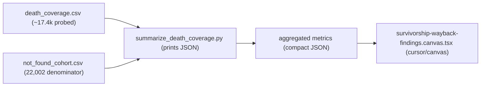

# Survivorship-Bias Wayback Findings (Cursor Canvas)

One live Cursor Canvas (`.canvas.tsx`, rendered beside the chat) analyzing `death_coverage.csv`. Findings-only: pure distribution/EDA of the wayback probe, no forward-looking projection or cost section. Built from the current frozen snapshot (~17.4k of 22,002 probed) with a clear in-progress note; refreshable for final numbers by re-running the aggregator.

## Why a canvas instead of the HTML builder

- **Lighter to build and iterate.** A canvas is a single React file using prebuilt `cursor/canvas` components (`Stat`, `BarChart`, `LineChart`, `PieChart`, `UsageBar`, `Table`, `Callout`). No Plotly CDN, no ~950-line HTML/CSS/JS template like [build_tavily_dashboard.py](data visualization/02_Analysis_Code/build_tavily_dashboard.py) - which is what felt like overkill.
- **Built for in-session insight.** It opens beside the chat for quick exploration, matching your "do this first" intent.
- **Tradeoff (worth knowing).** A canvas lives in Cursor's managed `canvases/` dir, not as a portable file in the repo. It is ideal for exploring now; if you later need a standalone artifact to formally submit/hand to your professor, the Python -> HTML builder remains the move. So: canvas to explore now, optional HTML to submit later.

## Key architecture point: aggregate, then embed

A canvas **embeds all its data inline** - no file reads, no `fetch()`. `death_coverage.csv` is ~6 MB / 17k rows, so we cannot (and should not) drop raw rows into the canvas. Instead a tiny read-only pandas step reduces it to a compact metrics JSON (counts, ~5-10 histogram bins, ~24 months of series, ~10 example rows = a few KB), which we paste inline. This mirrors the existing [summarize_coverage.py](wayback_machine/scripts/summarize_coverage.py), which already prints dashboard JSON to stdout.

## Files

- New canvas: `/Users/k/.cursor/projects/Users-k-Desktop-ai-native-startup-classification/canvases/survivorship-wayback-findings.canvas.tsx`
- New aggregator: `wayback_machine/scripts/summarize_death_coverage.py` (read-only; prints JSON; mirrors `summarize_coverage.py` for founded/drift buckets, `ts_to_date`, examples-with-Wayback-URL).
- Inputs (read-only, git-ignored data): `wayback_machine/data/death_coverage.csv`, `wayback_machine/data/not_found_cohort.csv`.

## Column mapping (what each chart reads)

- Recovery flags: `status` (`ok` / `no_snapshots` / `no_host` / `error:*`), `has_pre_death_snapshot`, `thin_history`.
- Quality (numeric, coerced from strings): `days_before_death`, `days_from_target`, `n_captures`, `lifespan_days`.
- Temporal (parsed `YYYYMMDDHHMMSS` -> datetime): `death_ts` (when the site died), `closest_ts` (the snapshot we'd classify), `first_ts`.
- Composition: `founded_date` (`YYYY-MM`), `website_alive`.
- Audit links: `target_url` (the chosen pre-death snapshot).

## Canvas sections (rendered with cursor/canvas components)

- **Overview.** `H1` + intro `Text`; a row of `Stat` KPIs (cohort 22,002, probed N, recoverable `ok`, pre-death-ready `ok & has_pre_death`, recovery rate %); a `Callout` (tone="info") noting the snapshot is partial/refreshable.
- **Recovery & status.** `UsageBar` segmented meter for the funnel composition (pre-death / thin / never-archived / error), plus a `BarChart` of status breakdown (ok / no_snapshots / each `error:*` / no_host). `Callout`: recoverable share + that ~2.1k errors are retryable.
- **Snapshot quality.** `BarChart` of `days_before_death` bins with a `ChartReferenceLine` at the ~180d target; `BarChart` of `days_from_target` drift buckets (<=7d, 8-30, 31-90, 91-180, >180); `BarChart` of `n_captures` buckets (1, 2-5, 6-20, 21-100, 100+). `Callout`: median buffer-before-death, % at parked-tail risk (<30d), % thin.
- **Temporal dynamics.** `LineChart` of `death_ts` and `closest_ts` counts by month, with a `ChartReferenceLine` at GPT-4 launch (2023-03-14). `Callout`: death clustering + share of recovered snapshots pre vs post GenAI (evidence-recency the classifier will "see").
- **Cohort composition.** `BarChart` of founded-year buckets (<=2018 ... 2024+ / unknown) and a `PieChart`/`BarChart` of `website_alive` (flagged-alive-but-unscrapeable vs dead).
- **Examples / audit.** A `Table` of representative recovered companies (name, founded, snapshot date, days-before-death) with `Link` cells to the `target_url` Wayback snapshot, including a few thin-history cases for spot-checking.

## Constants & conventions

- All colors via `useHostTheme()` tokens (no hardcoded hex); flat, minimal, no gradients/shadows/emojis (canvas slop rules).
- GPT-4 launch boundary `2023-03-14` (same constant the existing coverage tooling uses).
- Bin edges start from the `summarize_coverage.py` precedent, tuned to the actual snapshot distribution.

## Verification

- The `Canvas TypeScript check` line (returned on every canvas edit) must report no errors - that is the authoritative signal.
- Cross-check KPIs against the probe run log (pre-death ~14.4k, errors ~2.1k, never-archived ~235 at the snapshot point).
- Open beside the chat; run the pre-delivery self-check (visual hierarchy, composition variety, no slop; every chart titled with axis labels + a source/snapshot caption).
