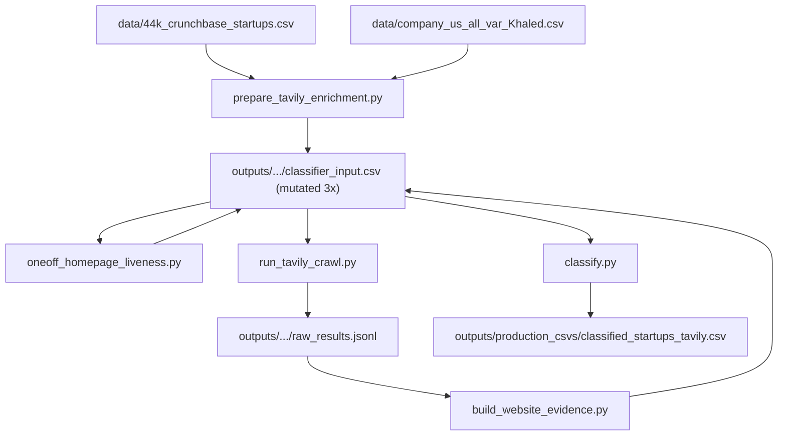
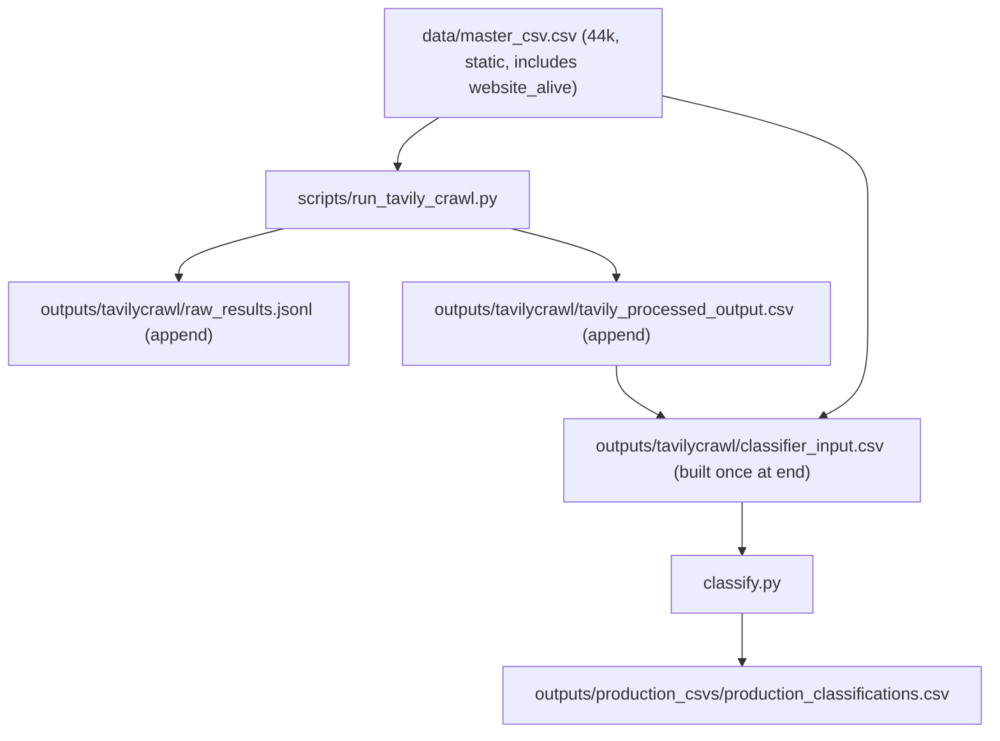

## Current state (what's complex)



Three issues:
- `classifier_input.csv` is overwritten three times (after enrichment, after liveness probe, after evidence build).
- Two source CSVs in `data/` (44k subset + master superset) are joined every run instead of being collapsed once.
- The crawler does not post-process inline; a separate `build_website_evidence.py` step does it after the run.

## Target state (what we want)



Four logical artifacts, one direction of flow, no in-place mutation of the same CSV.

## Schema (locked)

`data/master_csv.csv` — 11 columns, in this order:
- `org_uuid`, `name`, `homepage_url`, `short_description`, `Long description`, `category_list`, `category_groups_list`, `founded_date`, `employee_count`, `total_funding_usd`, `website_alive`
- All 44k rows. Rows with `website_alive=false` are skipped by the crawler.

`outputs/tavilycrawl/tavily_processed_output.csv` — 5 columns: `org_uuid`, `name`, `homepage_url`, `website_pages_used`, `website_evidence`. Header written once at run start; one row appended per finished company (after post-processing).

`outputs/tavilycrawl/classifier_input.csv` — produced once after the crawl as `master_csv ⨝ tavily_processed_output` on `org_uuid`. 13 columns (11 master + 2 evidence). Empty evidence for dead/uncrawled rows.

`outputs/production_csvs/production_classifications.csv` — classifier_input columns + classification result columns. Renamed from current `classified_startups_tavily.csv`.

## Concrete code changes

1. New one-time migration script `scripts/build_master_csv.py`
   - Reads the existing `outputs/tavilycrawl/classifier_input.csv` (which already has all 11 target columns including `website_alive` populated by `oneoff_homepage_liveness.py`).
   - Writes `data/master_csv.csv` with exactly the 11 columns in order.
   - Single use; can be deleted from version control after one run.

2. Slim [src/enrichment.py](src/enrichment.py) → [src/master_csv.py](src/master_csv.py) (rename + reduce)
   - Drop `build_enriched_dataset`, `write_enrichment_outputs`, `_normalize_long_description`, `_merge_prior_classifier_columns`, `_selected_master`, `_JOIN_MASTER_COLUMNS`. These exist only because of the subset+master join.
   - Keep `is_valid_homepage_url`, `tavily_eligible_mask`, `MASTER_CSV_COLUMNS` (renamed from `CLASSIFIER_INPUT_COLUMNS`).
   - Add `DEFAULT_MASTER_CSV = DATA_DIR / "master_csv.csv"`.
   - Net effect: the file goes from ~245 LoC to ~50 LoC.

3. Slim [src/website_evidence.py](src/website_evidence.py)
   - Keep `compact_tavily_response` and its helpers (boilerplate stripping, `_page_kind`, `_truncate`).
   - Delete `build_classifier_input_with_evidence`, `_load_latest_successful_records`, `EvidenceBuildReport`, `DEFAULT_ENRICHED_CSV`. Post-processing now happens inline in the crawler.

4. Refactor [src/tavily_crawl.py](src/tavily_crawl.py)
   - Default input becomes `DEFAULT_MASTER_CSV` (under `data/`).
   - Inside `persist_row`, after appending to `raw_results.jsonl`, also call `compact_tavily_response(record["response"])` and append one row to `tavily_processed_output.csv` under the existing `write_lock`. Use a small CSV-writer helper that writes the header once and appends thereafter (mirrors `_append_run_manifest`).
   - On clean termination (`exit_reason == "completed"`), call a new helper `write_classifier_input(master_csv, processed_csv, output_csv)` that joins master + processed and writes `classifier_input.csv`. Skip on user_interrupt/budget so resumes don't write a partial join.
   - Add new defaults: `DEFAULT_TAVILY_PROCESSED_CSV = TAVILY_DIR / "tavily_processed_output.csv"`, `DEFAULT_CLASSIFIER_INPUT_CSV = TAVILY_DIR / "classifier_input.csv"`.

5. Update [scripts/run_tavily_crawl.py](scripts/run_tavily_crawl.py)
   - Replace `--input/--queue` default with `DEFAULT_MASTER_CSV`.
   - Add `--processed-csv`, `--classifier-input` flags (with sensible defaults).
   - Drop the now-redundant import from `src.enrichment`.

6. Delete obsolete pipeline scripts
   - `scripts/prepare_tavily_enrichment.py`
   - `scripts/build_website_evidence.py`
   - `scripts/oneoff_homepage_liveness.py` (one-time use; its output is now baked into `master_csv.csv`)

7. Update [classify.py](classify.py) and [src/merger.py](src/merger.py)
   - `classify.py`: `DEFAULT_DATA_CSV` already follows `DEFAULT_CLASSIFIER_INPUT_CSV`; just update the import path after `enrichment.py` becomes `master_csv.py`.
   - `src/paths.py`: rename `DEFAULT_CLASSIFICATION_OUTPUT_CSV` to point at `production_classifications.csv` (was `classified_startups_tavily.csv`). Update [src/merger.py](src/merger.py) which uses the same constant.

8. Update [README.md](README.md) run order

   ```bash
   python scripts/run_tavily_crawl.py --budget-credits 100000
   python classify.py prepare
   python classify.py submit
   python classify.py download
   python classify.py merge
   ```

9. Update tests
   - [tests/test_enrichment.py](tests/test_enrichment.py): drop `test_build_enriched_dataset_*`, `test_build_crawl_queue_*`, `test_write_enrichment_outputs_*`, `test_build_classifier_input_with_evidence`, `test_build_classifier_input_clears_evidence_when_website_alive_false`.
   - Add `test_run_tavily_crawl_appends_to_processed_csv` (asserts header + one appended row per finished org with the 5 target columns).
   - Add `test_run_tavily_crawl_writes_classifier_input_on_completion` (asserts the join is correct: dead URLs present with empty evidence, crawled rows have evidence).
   - [tests/test_tavily_runner.py](tests/test_tavily_runner.py): replace `classifier_input.csv` fixtures with `master_csv.csv` fixtures.

## Cleanup of legacy artifacts (one-time, not code)

After the migration, these output-folder artifacts become orphans and can be deleted manually:
- `outputs/tavilycrawl/classifier_input_with_website_evidence.csv`
- `outputs/tavilycrawl/company_44k_enriched_for_classifier.csv`
- `outputs/tavilycrawl/crawl_queue.csv`
- `outputs/tavilycrawl/classifier_input_pilot*.csv`, `pilot_*_input.csv`, `evidence_quality_*.csv`
- All `crawl_state_*.json` except the active one
- All `raw_results_*.jsonl` except `raw_results.jsonl`

In `data/`:
- After `master_csv.csv` is verified, `44k_crunchbase_startups.csv`, `company_us_all_var_Khaled.csv`, and the orphan `company_us_short_long_desc_.csv` are no longer required by any code path.

## One small open detail

`founded_date`: the existing data has Crunchbase format like `01jan2020`. Your spec says "month and year format". The formatter at `format_user_message` already normalizes any of `01jan2020`, `01-Jan-20`, `2020-01-01` to `YYYY-MM-DD` or `YYYY`. Two options:
- Keep `01jan2020` in `master_csv.csv` (zero formatter changes; matches existing CSVs).
- Pre-normalize to `YYYY-MM` (e.g., `2020-01`) at `build_master_csv.py` time (cleaner CSV; trivial formatter tweak).

I'll default to **pre-normalize to `YYYY-MM`** in the migration script unless you'd prefer to keep the source format.