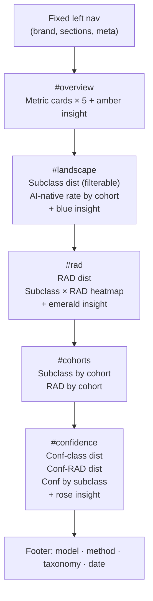

# Tavily 20k Dashboard

Produce a new self-contained HTML dashboard for the ~20,398-company Tavily-enriched classification run. The format is a direct fork of the existing builder; only the input path, titles, and narrative text change.

## Files involved

- **Source to fork:** [`data visualization/02_Analysis_Code/build_v2_dashboard_2.0.py`](ai-native-startup-classification/data%20visualization/02_Analysis_Code/build_v2_dashboard_2.0.py)
- **New builder:** `data visualization/02_Analysis_Code/build_tavily_dashboard.py`
- **Input CSV (when batches finish):** `outputs/production_csvs/production_classifications.csv`
- **Output HTML:** `data visualization/01_Presentation_Materials/tavily_20k_dashboard.html`

## What changes vs. v2.0 builder

The Python data pipeline (`compute_metrics`, `FILTER_DATA` loop, chart JS) is **identical** — same 10-class taxonomy, same 9 chart types. Only these things change:

**Input/output paths**
- `CSV_PATH` → `outputs/production_csvs/production_classifications.csv`
- `OUTPUT_PATH` → `data visualization/01_Presentation_Materials/tavily_20k_dashboard.html`

**Nav metadata (left sidebar)**
```
Model:    gpt-5.4-nano
Dataset:  ~20,398 startups · Crunchbase US
Method:   Tavily-enriched (website scraping)
Taxonomy: v2.1 (10 classes)
```

**Title & section copy**
- `<h1>`: "Tavily-Enriched Classification of ~20k US Startups" (vs. "V2.0 Two-Axis Classification of N US Startups")
- Overview paragraph: replace the v2.1 migration backstory with a one-paragraph note that these results use the **Tavily web-scraping pipeline** — each company's description was augmented with live homepage + product page content, directly reducing classification uncertainty
- The amber insight (low-confidence callout): reframe to show this is the **post-Tavily** confidence picture; expected to be materially lower than the 2.0 run that had description-only data

**Footer**
- Replace "Same dataset, refreshed taxonomy. Next step: re-run the LLM pipeline natively on v2.1 with agentic deep research." with "20,398-company subset. Inputs enriched with Tavily web scraping (homepage + product pages) before classification."
- Update date to May 2026

## Dashboard structure (unchanged)



## Execution

Run `python "data visualization/02_Analysis_Code/build_tavily_dashboard.py"` once `production_classifications.csv` is available. No other dependencies beyond `pandas`.
