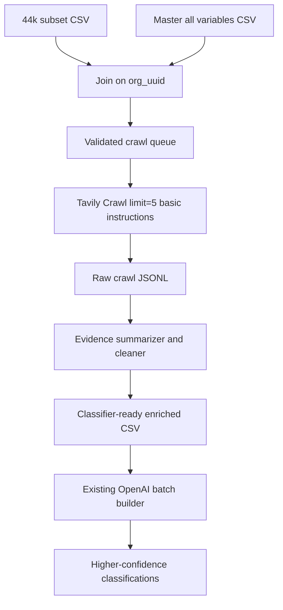

# Tavily Crawl Enrichment Plan

## Goal

Use `[data/44k_crunchbase_startups.csv](data/44k_crunchbase_startups.csv)` as the new crawl/classification cohort, enrich it from `[data/company_us_all_var_Khaled.csv](data/company_us_all_var_Khaled.csv)` by `org_uuid`, then crawl each valid `homepage_url` with Tavily to add high-signal website evidence to the GPT classifier.

## Current Context

The dashboard at `[data visualization/01_Presentation_Materials/v2_dashboard2.0.html](data%20visualization/01_Presentation_Materials/v2_dashboard2.0.html)` shows the current bottleneck clearly: median classification confidence is 3, and 48.1% of classifications have `conf_classification <= 2` because the current classifier mostly sees Crunchbase short and long descriptions.

The current formatter ignores homepage data and only builds prompts from `org_uuid`, `name`, `short_description`, `Long description`, `category_list`, `category_groups_list`, and `founded_date` in `[src/formatter.py](src/formatter.py)`:

```50:80:src/formatter.py
def format_user_message(row: dict[str, Any]) -> str:
    """Convert one CSV row into the user message string.

    Args:
        row: Dictionary whose keys are raw CSV column names
             (org_uuid, name, short_description, Long description,
              category_list, category_groups_list, founded_date).
...
    parts = [
        f"CompanyID: {cid}",
        f"CompanyName: {cname}",
        f"Short Description: {short}",
    ]
```

## Data Preparation

Create a read/validation step that:

- Loads `[data/44k_crunchbase_startups.csv](data/44k_crunchbase_startups.csv)` as the canonical cohort.
- Loads `[data/company_us_all_var_Khaled.csv](data/company_us_all_var_Khaled.csv)` as the master-variable source.
- Left-joins selected master variables onto the 44k subset by `org_uuid`.
- Normalizes `description` to the classifier’s expected `Long description` naming.
- Reports duplicate `org_uuid`, unmatched subset rows, invalid/missing `homepage_url`, duplicate domains, and closed/inactive companies.

Default master fields to carry forward: `rank`, `state_code`, `region`, `city`, `status`, `num_funding_rounds`, `total_funding_usd`, `employee_count`, `linkedin_url`, `twitter_url`, `last_funding_date`, `closed_date`. Keep this list configurable.

## Tavily Crawl Configuration

Use Tavily Crawl with these defaults:

- `limit=5` to cap every company at five processed pages.
- `extract_depth="basic"` to avoid the 2x advanced extraction cost.
- `instructions` enabled because page selection quality is central to the research goal.
- `chunks_per_source=3` initially, so instructed crawls return compact relevant snippets rather than full noisy pages.
- `max_depth=2` to allow the crawler to reach product/about/careers pages from the homepage.
- `max_breadth=12` as a conservative breadth cap.
- `format="markdown"` for cleaner source-preserving content.
- `include_usage=true` for real budget tracking.
- `allow_external=false` unless Tavily requires external links for canonical hosted pages; start with same-domain-only to avoid Crunchbase, socials, docs hosts, and ad/legal noise.
- `exclude_paths` for low-signal pages such as legal, privacy, terms, cookies, security policy, press-only/news-only paths, investor relations, login, signup, pricing checkout, docs API references, support centers, and blog archives.

Instruction template:

```text
Select up to 5 pages that best explain what this company actually builds and sells for AI-native startup classification. Prioritize homepage, product/platform/solutions pages, about/company pages, careers/team/hiring pages, and technical/research pages. Prefer pages with evidence about product mechanism, AI/ML/LLM usage, autonomous agents, proprietary models/data, target users, and workflow depth. Avoid legal, privacy, terms, cookie, login, checkout, generic blog/news, support, and social pages.
```

## Cost Control

Tavily docs price Crawl as mapping plus extraction. With `instructions`, mapping costs 2 credits per 10 successful mapped pages; basic extraction costs 1 credit per 5 successful extractions.

For ~44k companies at 5 pages/company:

- Nominal proportional estimate: about 2 credits/company, or about 88k credits. On the $500 Growth plan rate of $0.005/credit, this is about $440.
- Conservative per-request rounded estimate: about 3 credits/company, or about 133k credits. At $0.005/credit, this is about $665.
- Pay-as-you-go at $0.008/credit would exceed $500 for full coverage.

Implementation should therefore include:

- A configurable hard credit budget, default `100000` credits or `$500` at Growth pricing.
- A preflight estimate using row count, valid URL count, and the selected pricing mode.
- Per-request usage capture from `include_usage=true`.
- Automatic stop/resume once actual cumulative usage approaches the budget ceiling.
- A pilot mode for the first 250-500 companies to measure real pages returned, failures, credit rounding, content length, and classifier signal before the full run.

## Pipeline Shape



## Implementation Steps

1. Add a small enrichment config layer for input paths, selected master columns, Tavily crawl defaults, budget ceiling, and output paths.
2. Add a `prepare_enriched_dataset` script that joins the 44k subset to the master by `org_uuid`, harmonizes `description` / `Long description`, validates URLs, and writes a crawl queue.
3. Add a Tavily crawl runner that reads the queue, skips already-crawled `org_uuid`s, calls Crawl with the tuned defaults, writes append-only JSONL results, and persists usage/failure state for resume.
4. Add a cleaner that converts Tavily results into compact fields such as `website_pages_used`, `website_evidence`, `website_crawl_status`, and `website_credit_usage`.
5. Update `[src/formatter.py](src/formatter.py)` and `[prompts/Multiclassification_prompt.txt](prompts/Multiclassification_prompt.txt)` to include website evidence as a first-class input source while preserving existing batch classification output schema.
6. Add focused tests for `org_uuid` joins, column harmonization, URL validation, prompt formatting with website evidence, and budget stop/resume behavior.
7. Run a 250-500 company pilot, inspect credit usage and content quality, then decide whether to crawl the full ~44k under the measured budget curve.

## Validation

- Confirm joined row count equals the 44k subset row count unless duplicates are explicitly removed.
- Confirm every output row preserves `org_uuid` and `name`.
- Report crawl coverage: valid URLs, successful crawls, failed crawls, pages returned per company, average chars/chunks per company, and total Tavily credits.
- Re-run a small classification batch comparing old vs enriched prompts and measure confidence lift, especially movement out of `conf_classification <= 2`.
- Keep all raw Tavily responses so research findings remain auditable and source-backed.