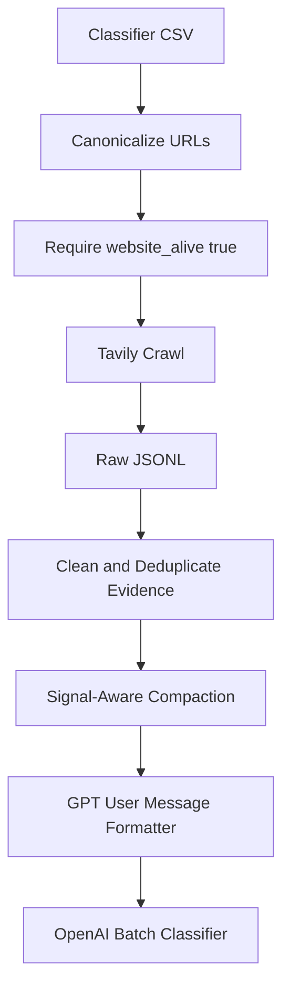

# Tavily Signal Quality Plan

## Findings

The successful requests are directionally good but not yet optimal for the classifier.

- Page selection is often useful: examples include homepage, company/about, operations, services, use-cases, pricing, and product pages.
- Evidence formatting is structurally good: `Website Pages Used` plus `[Page N: route]`, URL, and content is easy for GPT to cite and reason from.
- The main weakness is raw-content noise. Successful outputs include navigation menus, repeated CTAs, image markdown, phone/email blocks, blog/news snippets, footer/legal content, and duplicated sections.
- No truncation preserves signal, but it also preserves noise. Some pages are large enough that the classifier may spend attention on boilerplate instead of product mechanism.
- `EmployeeCount: 10-Jan` is a data-formatting bug from CSV/Excel-style ranges and should be normalized before GPT sees it.

## Recommended Approach

Prioritize post-processing over aggressive API tuning.

1. Add a website evidence cleaning layer in [`/Users/k/Desktop/ai-native-startup-classification/src/website_evidence.py`](/Users/k/Desktop/ai-native-startup-classification/src/website_evidence.py):
   - Remove markdown image-only lines and obvious image asset lines.
   - Drop repeated navigation/footer/contact boilerplate lines.
   - Remove or down-rank generic CTAs like `Book a demo`, `Get in touch`, `All rights reserved`, `top of page`, `bottom of page`.
   - Deduplicate repeated lines and repeated short blocks within each page.
   - Keep headings, product/service descriptions, mechanism claims, customer/use-case claims, pricing snippets, technical/research claims, and explicit AI/automation claims.

2. Add compact per-page evidence shaping, not hard truncation:
   - Keep the first high-signal overview section.
   - Keep sections with keywords like product, platform, services, solution, use case, pricing, AI, automation, model, data, API, workflow, integration, customer, industry.
   - If a page remains very large after cleaning, cap it generously with a signal-aware cutoff instead of raw first-N characters.

3. Normalize URL quality before Tavily:
   - Follow redirects and crawl the final canonical URL.
   - Store both original and canonical URL for audit.
   - Require `website_alive == true` before crawl once the liveness job has populated it.

4. Keep API hyperparameters mostly stable for now:
   - Keep `limit=5`; it gives enough page diversity for classification.
   - Keep `max_depth=2`; useful for services/use-case pages.
   - Reduce `max_breadth` from `20` to `12-15` after canonical URL handling, unless tests show it hurts page discovery. Current `20` may increase noisy page discovery without much added signal.
   - Keep `extract_depth="basic"`; advanced extraction is not justified until post-processing is clean.
   - Test `chunks_per_source=3` vs `4`; `4` captures more content but may increase repetition. Do not change blindly.

5. Improve final formatter in [`/Users/k/Desktop/ai-native-startup-classification/src/formatter.py`](/Users/k/Desktop/ai-native-startup-classification/src/formatter.py):
   - Normalize employee-count ranges, especially `10-Jan` to `1-10`.
   - Add optional crawl status only for audit/debug outputs, not necessarily production GPT input.
   - Keep the existing large emergency guard, but rely on cleaned evidence to reduce message size.

## Validation

Run the same pilot set through old vs cleaned evidence and compare:

- Rows with evidence recovered.
- Average GPT-facing message length.
- Noise markers per row, such as images, footer phrases, CTAs, legal text, and repeated nav.
- Manual review of 10-20 GPT-facing messages.
- Classification confidence and rationale quality after a small OpenAI batch sample.

## Data Flow

## Bottom Line

Do not optimize primarily by turning Tavily knobs yet. The current successful pages contain useful signal, but the classifier input is too raw. Clean and compact the evidence first, canonicalize URLs, then run a small A/B pilot before changing `max_breadth` or `chunks_per_source` globally.