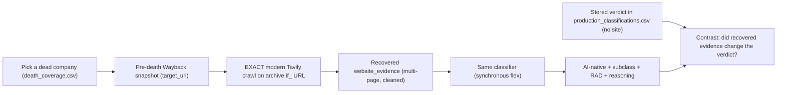
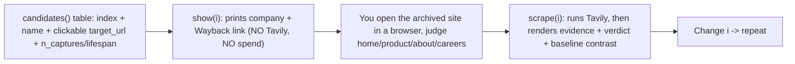

# Wayback -> Tavily -> Classify: Demo Harness

> **PLAN 1 of 2.** Self-contained, demo-able artifact on its own branch + PR(s).
> Its output (the GO/PIVOT methodology decision) gates the production pipeline in
> the separate **Dead-Cohort Tavily Production Pipeline** plan, which reuses this
> harness's module as its scrape worker.

## Why this exists (two jobs, one artifact)

1. **Demo (tomorrow, with your research professor):** show the entire data flow for a company that is *gone from the live web* - from its Wayback snapshot URL, through the same Tavily crawler we used on live companies, into the same classifier, to a final AI-native/RAD classification. This is the "we can see the invisible companies now" story that informs research direction.
2. **Methodology gate:** prove the EXACT modern 5-page crawl is feasible on archived URLs (clean, multi-page, classifier-grade), or surface that it is not - the GO/PIVOT call.

Scope is deliberately small: no production runners, no namespace refactor, no 22k run. Those live in Plan 2.

## Demo data flow (the story to tell)

The baseline-vs-recovered contrast is the research payoff: it shows whether recovering dead-site evidence actually changes a classification versus the **metadata-only label these companies already have** in `production_classifications.csv` (their published verdict was made with empty `website_evidence`).

## Human-in-the-loop UX (locked with you)

A deliberate **two-step, one-at-a-time** loop - inspect for free, then spend:

Decisions locked:
- **Selection:** index-based variable (`show(i)` / `scrape(i)` off the candidates table) edited and re-run. No `ipywidgets` - bulletproof and reproducible for a live demo.
- **View the site:** clickable Wayback browser link (open the real archived site, click through pages to judge substance). No inline iframe.
- **Timing:** inspect-first - `show(i)` never spends; `scrape(i)` is the deliberate paid step, so we never crawl a company you have not eyeballed.
- **Panel content:** `scrape(i)` shows raw pages + URLs, the cleaned `website_evidence`, the exact `format_user_message` classifier input, the with-evidence flex verdict, and the **stored** baseline verdict side-by-side.
- **Baseline source:** the actual row from `production_classifications.csv` (real published artifact; zero cost; deterministic). Caveat for rigor: that verdict came from the Batch path while the recovered one uses flex - same prompt+schema, so evidence is still the dominant difference; a strict live metadata-only run can be added later if needed.
- **Caching:** each `(company, config)` Tavily result is cached so re-selects are instant and never re-spend.

## Key technical facts baked into the harness

- Crawling needs Wayback's `**if_**` modifier, not `id_`: `id_` returns raw bytes with no link rewriting, so the crawler escapes to the dead **live** domain; `if_` strips the toolbar **and** keeps links inside the archive. The harness exposes this as a toggle so the failure mode is visible.
- On the archive the host is `web.archive.org`, so confining a crawl to one company needs a per-company `select_paths` regex + `select_domains=["^web\.archive\.org$"]` (also a toggle).
- Unavoidable gaps to *observe*: sub-page date drift (links resolve to nearest capture), archive-only page universe, IA throttling.

## Build

### 1. Branch

Create `feat/wayback-tavily-demo-harness` off the current `feat/removing-survivorship-bias` (which already has the probe, the `wayback_machine/` package, and the local `death_coverage.csv`).

### 2. Reusable module: `wayback_machine/tavily_archive_lab.py`

Plain Python so its functions later become the Plan 2 scrape worker (no divergence):

- `candidates(death_coverage_csv, n, sort_by)` - rank `ok` rows by richness proxies (`n_captures` desc, `lifespan_days` desc); return an indexed table of `name, homepage_url, website_alive, target_url, latest_url, earliest_url, n_captures, lifespan_days`. Reads the live CSV defensively (probe is still appending).
- `archive_url(homepage_url, ts, modifier)` - build `web.archive.org/web/<ts><modifier>/<homepage>` for `modifier in {"", "if_", "id_"}`.
- `crawl_archive(company, cfg, *, modifier="if_", scope=True)` - call the **exact** `TavilyCrawlConfig` + `call_tavily_crawl` / `_call_tavily_crawl_with_retries` + shared `compact_tavily_response` from [src/tavily_crawl.py](src/tavily_crawl.py) (limit 5, depth 2, breadth 20, the page-selection instructions, the empty-instructions fallback); optional per-company `select_paths`/`select_domains`.
- `extract_archive(company, *, modifier="id_")` - single-page homepage extract (the PIVOT method) for side-by-side.
- `diagnose(response)` - pages returned, % of result URLs under the company's own archived path vs archive chrome/other domains, total chars, credits.
- `classify_with_evidence(row, cleaned_evidence)` - build the user message via [src/formatter.py](src/formatter.py) `format_user_message`, call the OpenAI Responses API synchronously on the **flex** tier (reusing `load_system_prompt`, `_openai_strict_schema`, `get_client` - mirrors `classify.py test`), return a validated `ClassificationResult`.
- `baseline_verdict(org_uuid)` - look up the company's existing row in `production_classifications.csv` (keyed on `CompanyID == org_uuid`); this is the "before" (no-site) verdict for the contrast. Zero cost, deterministic.
- `_cache` - in-memory dict keyed by `(org_uuid, config_signature)` so a re-`scrape(i)` is instant and never re-spends; optionally persisted to a JSONL under `wayback_machine/outputs/` for cross-session reuse.

### 3. Interactive notebook: `wayback_machine/notebooks/tavily_archive_lab.ipynb`

No widgets - selection is an index variable you edit and re-run. Cells, ordered as the demo narrative:

1. Setup + imports.
2. The problem: ~22k of 44,387 companies are dead/unextractable and currently classified on metadata only (1 line of stats).
3. `candidates(...)` table: indexed rows with clickable Wayback links (`target_url`, `latest_url`, `earliest_url`) + `n_captures`/`lifespan_days` so you can browse and judge substance.
4. Global `CONFIG` dict mirroring `TavilyCrawlConfig` with toggles: `method` (crawl/extract), `modifier` (`if_`/`id_`), `scope` (on/off), plus `limit`/`max_depth`/`instructions` for experimentation.
5. **`show(i)`** - inspect cell (free): prints the selected company's name/metadata and its Wayback browser link. You open it and judge home/product/about/careers footprint. No Tavily call, no spend.
6. **`scrape(i)`** - the deliberate paid cell: runs Tavily on that snapshot under the current `CONFIG`, then renders (a) raw page count + the page URLs returned, (b) `diagnose` summary, (c) the cleaned `website_evidence` (markdown), (d) the exact `format_user_message` classifier input, (e) the **with-evidence** flex verdict next to the **stored baseline** verdict from `production_classifications.csv` - the headline contrast.
7. Compare cell: `scrape(i)` under crawl vs extract (and `if_` vs `id_`) on the same company, to see the GO/PIVOT tradeoff directly.
8. Findings cell: a short written GO/PIVOT recommendation across the companies you verified.

### 4. Dependencies

Add `jupyter` + `ipykernel` to `[project.optional-dependencies].dev` in [pyproject.toml](pyproject.toml) (first notebook in the repo).

## Human-in-the-loop (you)

Per the locked loop: browse the `candidates` table, `show(i)` to get a company's Wayback link, open it and confirm a real footprint (home / product / about / careers) before dying, then `scrape(i)` on the verified ones and judge the recovered `website_evidence` + the verdict contrast together. Those confirmations + the notebook output = the GO/PIVOT decision recorded in the findings cell.

## Demo readiness checklist

- Notebook runs top-to-bottom without manual fixups; the verified `CHOSEN` indices/ids are pinned so the demo is reproducible.
- Each company shows: a Wayback snapshot link, recovered multi-page evidence, and a real with-evidence classification with reasoning.
- The stored-baseline vs recovered-evidence verdict contrast is visible for at least one company (ideally one where the verdict flips).

## Cost

A few dozen Tavily credits total (crawl ~1 credit/company x 5, plus a couple of config experiments); classifications use the near-free flex tier. Negligible.

## PR(s)

One focused PR on `feat/wayback-tavily-demo-harness` (module + notebook + dev deps). Optionally split into two: (a) `tavily_archive_lab.py` + deps, then (b) the notebook - if you prefer smaller reviews.

## Files

- New: `wayback_machine/tavily_archive_lab.py`, `wayback_machine/notebooks/tavily_archive_lab.ipynb`
- Edit: [pyproject.toml](pyproject.toml) (notebook dev deps)
- Reused, unmodified: [src/tavily_crawl.py](src/tavily_crawl.py) (crawl config + functions), [src/website_evidence.py](src/website_evidence.py) (cleaner), [src/formatter.py](src/formatter.py), [classify.py](classify.py)/`src` classifier primitives, `death_coverage.csv` (read-only).
