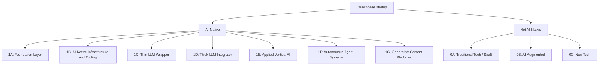

# AI-Native Startup Taxonomy

This is one strand of my work as an AI student researcher at the University of British Columbia. The companion working paper is on SSRN: [Prompted to Start: How Generative AI is Transforming Entrepreneurship](https://papers.ssrn.com/sol3/papers.cfm?abstract_id=5749564).

The categories VC analysts use to describe startups have changed dramatically since the inflexion point of the release of GPT-4. I designed a new startup taxonomy that takes that shift seriously, separating companies into 10 subclasses anchored by their AI-nativeness. I then built and scaled a classification pipeline processing 10B+ tokens across **270k Crunchbase companies**.

**Table of contents**

- [Taxonomy](#taxonomy)
- [Pipeline architecture](#pipeline-architecture)
- [Pipeline engineering highlights](#pipeline-engineering-highlights)
  - [Cost optimization](#cost-optimization)
  - [LLM integration](#llm-integration)
  - [Pipeline scale and robustness](#pipeline-scale-and-robustness)

## Taxonomy

Every company is classified along **two parallel axes**: an AI-native dimension with a sub-genre, and a Resource-Adjusted AI Dependency (RAD) score. The RAD score answers a structural question that subclass alone cannot: Based on their funding and scale, how defensible / dependent is the startup on foundational model providers?

Startups receive:

- **Low RAD** when they show credible signals of structural independence, such as proprietary models in development or scale large enough to go independent.
- **High RAD** when they are massivly dependent on foundational model API's.

## Pipeline architecture

Before classifying a company I enrich every row with live evidence from its own website, then joins it with crunchbase data and inputs it into the classifier.

- **Tavily crawl** asks Tavily to pick the five most informative pages from each homepage and return them as markdown.
- **NLP post-processing** strips boilerplate and packs the high-signal text into a fixed budget.
- **Join with Crunchbase fields** stitches the website evidence back together with descriptions, keywords, founding date, funding, and headcount.
- **Structured output** is validated against a Pydantic schema and merged into a single production CSV.

## Pipeline engineering highlights

### Cost optimization

- **Live-website filter before any paid Tavily API web crawler call.** 
- **Budget prediction and capping.** Both halves of the pipeline forecast spend before any token is purchased. The Tavily crawler is given a target credit budget up front and stops cleanly at the cap. The OpenAI classifier counts tokens with tiktoken and prints projected cost before submitting.
- **Prompt caching.** The system prompt is stable by design across every one of the 270k requests, so OpenAI's prompt cache discounts the bulk of input tokens automatically.

### LLM integration

- **System prompt as a first-class artifact.** A single source-controlled system prompt defines the two-axis taxonomy, the evidence hierarchy, the RAD assignment rules, and a worked few-shot example for every subclass.
- **Web crawl post-processing into LLM-ready evidence.** Markdown returned from each crawl is stripped of navigation chrome, cookie banners, image lines, and duplicate menu items, then packed signal-first into a fixed character budget so the model sees only the highest-signal evidence per company.
- **Structured output via Pydantic.** Every classification returns the same eleven typed fields, with schema-violating responses rejected at parse time, so the merged CSV loads straight into pandas with no defensive cleaning.
- **Confidence scoring on every output.** Each classification reports a separate 1-5 confidence score for the subclass call and the RAD call, so downstream analysis can filter to high-confidence rows or audit ambiguous ones directly.
- **LLM self-critique** for each classification to flag borderline and low-confidence  classifications.

### Pipeline scale and robustness

- **Rate limiting tuned to OpenAI's queue ceiling.** The submitter respects OpenAI's batch-queue token cap and only puts another batch in flight when there is real headroom, instead of guessing a concurrency number that fails halfway through.
- **Surgical retries.** Failed rows from any batch are pulled out by id and re-submitted as a fresh, properly sized batch, instead of re-running the whole job.
- **Live status polling.** All in-flight batches are polled in parallel on a fixed interval and rendered into a live status table, so a multi-hour OpenAI batch processing run is observable in real time.
- **Resumable end-to-end.** Every stage (prepare, submit, monitor, download, merge, retry) reads a checkpoint and skips completed work. A 270k-row classification run can be paused, resumed, or partially re-run without losing progress.

