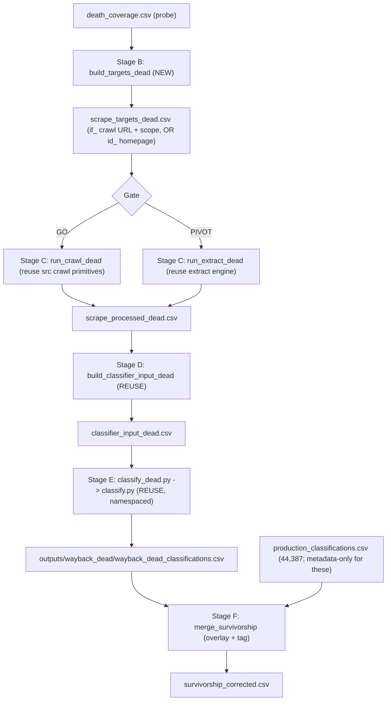

# Survivorship-Bias Tavily -> Classify Pipeline (Dead Cohort)

## Goal

Turn `death_coverage.csv` (the probe is filling it now; 425 `ok` rows already) into evidence-based classifications for as many of the ~22k dead/unextractable companies as possible, using the **same** classifier as the modern cohort, then merge to correct survivorship bias.

The modern cohort was built with Tavily `**/crawl`** (up to 5 query-selected pages: see [src/tavily_crawl.py](src/tavily_crawl.py) `TavilyCrawlConfig` and `DEFAULT_INSTRUCTIONS`), not single-page `/extract`. To keep the dead-vs-modern comparison controlled, we must first prove the **same 5-page crawl** works on archived URLs before committing budget. That proof is Phase 0 and it gates everything else.

## Phase 0 - Validate the scraping methodology (DO NOW, while the probe runs)

The decisive, money-saving step. Cheap (a few dozen credits) and built on the data we already have.

Key technical facts that shape the test (confirmed):

- Crawling needs Wayback's `**if_`** modifier, not `id`_. `id`_ returns raw bytes with no link rewriting, so internal links point at the dead **live** domain and the crawler escapes the archive. `if_` strips the toolbar **and** rewrites links to stay in-archive - exactly what a crawl needs. (The 2023 extract path correctly used `id_` because single-URL extract never follows links.)
- On the archive the host is `web.archive.org`, so `allow_external=false` alone lets the crawler roam the whole archive. Confining it to one company needs a per-company `select_paths` regex (e.g. `^/web/\d+(?:if_)?/https?://(www\.)?example\.com/.`*) + `select_domains=["^web\.archive\.org$"]`.
- Inherent, unavoidable gaps to *measure*, not eliminate: sub-page links resolve to the nearest capture (date drift across the 5 pages), the archive only holds what IA captured, and IA throttles Tavily's fetches.

### Module: `wayback_machine/tavily_archive_lab.py`

Reusable so the verified config flows straight into production (no divergence). Functions:

- `candidates(death_coverage_csv, n, sort_by)` - rank `ok` rows by richness proxies (`n_captures` desc, `lifespan_days` desc); return `name, homepage_url, target_url, latest_url, earliest_url, n_captures, lifespan_days` so you can click the Wayback links and judge substance.
- `archive_url(homepage_url, ts, modifier)` - build `web.archive.org/web/<ts><modifier>/<homepage>` for `modifier in {"", "if_", "id_"}`.
- `crawl_archive(company, cfg, *, modifier="if_", scope=True)` - call the **exact** `call_tavily_crawl` / `_call_tavily_crawl_with_retries` + `TavilyCrawlConfig` (limit 5, depth 2, breadth 20, instructions, empty-instructions fallback) from [src/tavily_crawl.py](src/tavily_crawl.py); optional per-company `select_paths`/`select_domains`; clean via the shared `compact_tavily_response`.
- `extract_archive(company, *, modifier="id_")` - the single-page homepage extract (the PIVOT method) for side-by-side comparison.
- `diagnose(response)` - pages returned, % of result URLs under the company's own archived path vs archive chrome/other domains, total chars, credits.
- `classifier_preview(cleaned_row)` - run [src/formatter.py](src/formatter.py) `format_user_message` to show the exact classifier input; optional near-free flex `classify.py test` to see the label.

### Notebook: `wayback_machine/notebooks/tavily_archive_lab.ipynb`

The interactive front-end (cells): setup -> print candidates + clickable links -> set `CHOSEN = [5 org_uuids]` -> config dict mirroring `TavilyCrawlConfig` with toggles (`method` crawl/extract, `modifier` if_/id_, `scope` on/off) -> run the 5 and render per-company report (raw summary + cleaned `website_evidence` + classifier input) -> deep-dive one company (rendered markdown) -> optional flex-classify the 5 -> archive-crawl vs homepage-extract side-by-side. Add `jupyter`/`ipykernel` to `[project.optional-dependencies].dev` in [pyproject.toml](pyproject.toml) (first notebook in the repo).

### The GO/PIVOT gate (with you)

You manually verify the 5 picks have a real footprint, we run the exact-config crawl, and we judge the `website_evidence` quality together. Then:

- **GO** (archive crawl yields clean, multi-page, classifier-grade evidence) -> build Stage B/C around the 5-page crawl.
- **PIVOT** (mostly archive chrome / incompatible) -> fall back to single-page homepage extract and document it as a limitation in the paper.

## Design principles (Phase 1)

- **Reuse the classifier wholesale.** `classify.py` only reads `CLASSIFIER_INPUT_COLUMNS`; we feed a different `website_evidence`. Identical model + prompt + schema is what makes the comparison valid.
- **Match the scraping method to modern** as closely as the gate allows (crawl if viable), so evidence is the only intended difference.
- **Total isolation via a namespaced workspace.** Every modern batch path derives from constants in [src/paths.py](src/paths.py) bound at import time. One env var (`CLASSIFY_NS=wayback_dead`) cascades to `state.py`, `builder.py`, `downloader.py` with no other `src` edits, routing state/batches/results/errors/output CSV under `outputs/wayback_dead/`. Nothing touches the finished modern run.
- **Leave the 2023/live code byte-identical.** Add dead-suffixed CLIs beside them (same convention as `cdx.py` vs `probe_coverage.py`).
- **Selection = all resolvable, thin flagged:** `status==ok` and non-empty `closest_ts`, every founding date, `thin_history` carried as a column.

## Phase 1 data flow (method locked by the gate)




### Step 1 - New artifact paths

Add dead-suffixed paths to [wayback_machine/paths.py](wayback_machine/paths.py): `DEATH_COVERAGE_CSV`, `SCRAPE_TARGETS_DEAD_CSV`, `SNAPSHOTS_DEAD_JSONL`, `EXTRACT_STATE_DEAD_JSON`, `RUN_MANIFEST_DEAD_CSV`, `SCRAPE_PROCESSED_DEAD_CSV`, `CLASSIFIER_INPUT_DEAD_CSV`, `EXTRACT_DEAD_LOG` (+ crawl-variant names if GO).

### Step 2 - Stage B: dead targets (NEW)

New `wayback_machine/targets_dead.py` + CLI `wayback_machine/scripts/build_targets_dead.py`, modeled on [wayback_machine/targets.py](wayback_machine/targets.py): read `death_coverage.csv`, dedupe by `org_uuid` preferring `status==ok`, keep `status==ok` & non-empty `closest_ts` (no founded cutoff), carry provenance (`death_ts`, `days_before_death`, `thin_history`, `website_alive`).

- **GO:** emit the `if`_ archive crawl URL + a per-company `select_paths` regex.
- **PIVOT:** emit the `id`_ homepage `snapshot_url` via [wayback_machine/cohort.py](wayback_machine/cohort.py) `build_snapshot_url`.

### Step 3 - Stage C: paid scrape (REUSE)

- **GO:** new `wayback_machine/scripts/run_crawl_dead.py` (+ a `crawl_dead.py` runner) wrapping the Phase 0 `crawl_archive` worker with the same reliability harness as [wayback_machine/extract.py](wayback_machine/extract.py) (resumable JSONL, sliding-window limiter, outage loop, SIGINT, budget cap), writing to dead paths. Rewrites each page's archive URL back to the original homepage in the evidence (mirroring the extract path) so the format matches the live + 2023 scrapes.
- **PIVOT:** new thin `wayback_machine/scripts/run_extract_dead.py` calling [wayback_machine/extract.py](wayback_machine/extract.py) `run_extract()` with dead paths.

### Step 4 - Stage D: classifier input (REUSE)

New thin `wayback_machine/scripts/build_classifier_input_dead.py` calling [wayback_machine/classifier_input.py](wayback_machine/classifier_input.py) `build_classifier_input_2023()` with `processed=scrape_processed_dead.csv`, `output=classifier_input_dead.csv`. It inner-joins onto `master_csv.csv` (which contains these companies), so only the evidence differs.

### Step 5 - Stage E: isolated classification (small src edit + wrapper)

- Edit [src/paths.py](src/paths.py) (~6 lines): read `CLASSIFY_NS`; when set, route `BATCH_DATA_DIR -> outputs/<ns>/batch_data` (raw/requests/results/errors/state derive from it) and `DEFAULT_CLASSIFICATION_OUTPUT_CSV -> outputs/<ns>/<ns>_classifications.csv`. No other `src` changes.
- New `wayback_machine/scripts/classify_dead.py`: sets `os.environ["CLASSIFY_NS"]="wayback_dead"` **before** importing, then delegates to `classify.main()` so all subcommands run against the dead workspace.

### Step 6 - Stage F: survivorship-corrected merge (NEW)

New `wayback_machine/scripts/merge_survivorship.py`. All 44,387 are already in `production_classifications.csv` (classified metadata-only for the evidence-less ones), so this is an **overlay**: start from the modern CSV, add `evidence_source` (`live` default), then for each recovered dead `org_uuid` replace the row with the evidence-based dead classification tagged `wayback_dead` (+ `snapshot_ts`/`thin_history`). Output `outputs/wayback_dead/survivorship_corrected.csv` + a before/after distribution summary.

## Run order (after GO + probe finishes)

```bash
python wayback_machine/scripts/build_targets_dead.py
# GO path:
caffeinate -ims python wayback_machine/scripts/run_crawl_dead.py     # paid, resumable, overnight-safe
# (PIVOT path: run_extract_dead.py instead)
python wayback_machine/scripts/build_classifier_input_dead.py
python wayback_machine/scripts/classify_dead.py run --data wayback_machine/outputs/processed/classifier_input_dead.csv
python wayback_machine/scripts/merge_survivorship.py
```

## Cost / throughput notes

- Phase 0 is a few dozen credits. The full scrape is the real spend.
- **Crawl (GO)** bills per page: ~5 pages/company. If ~15-18k resolve, expect ~5x the single-page cost - this is the price of matching the modern methodology. `--budget-credits` caps it.
- **Extract (PIVOT)**: 1 credit / 5 successful single-page extractions (~3,000-3,600 credits).
- Throughput is bounded by IA throttling Tavily's fetches (empty/transient), absorbed by the outage loop.

## Files

- New: `wayback_machine/tavily_archive_lab.py`, `wayback_machine/notebooks/tavily_archive_lab.ipynb`, `wayback_machine/targets_dead.py`, `scripts/build_targets_dead.py`, `scripts/run_crawl_dead.py` (GO) or `scripts/run_extract_dead.py` (PIVOT), `scripts/build_classifier_input_dead.py`, `scripts/classify_dead.py`, `scripts/merge_survivorship.py`
- Edit: [pyproject.toml](pyproject.toml) (notebook dev deps), [wayback_machine/paths.py](wayback_machine/paths.py) (dead paths), [src/paths.py](src/paths.py) (`CLASSIFY_NS` namespace)
- Untouched: classifier engine (`src/builder.py`, `state.py`, `downloader.py`, `submitter.py`, `monitor.py`), the live crawl config in `src/tavily_crawl.py` (reused, not modified), and all 2023-stage code.

