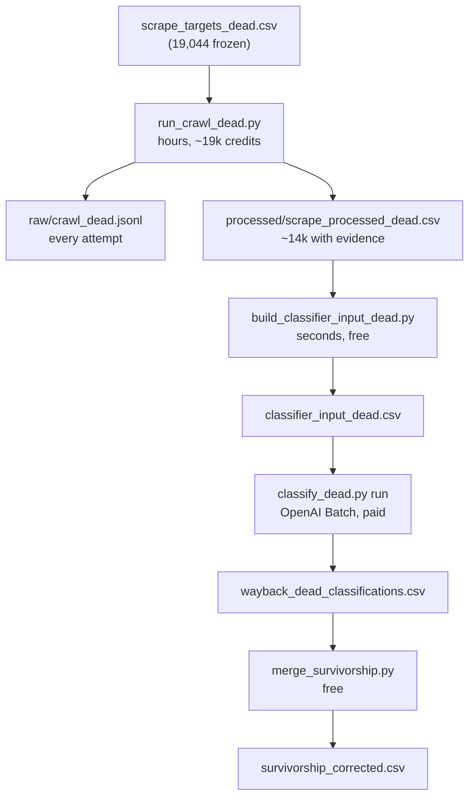

Here is the full path, end to end, in the order you will actually run it.

---

## Big picture

There are **four phases** after the work list is already frozen:

```
[already done]  scrape_targets_dead.csv  (19,044 companies)
       ↓
Stage C (paid, long)   Tavily crawl  →  raw/ + processed/
       ↓
Stage D (free, fast)   join master metadata  →  classifier_input_dead.csv
       ↓
Stage E (paid)         OpenAI Batch classify  →  wayback_dead_classifications.csv
       ↓
Stage F (free)         overlay onto live dataset  →  survivorship_corrected.csv
```

Stages A–B (death probe → `scrape_targets_dead.csv`) are already done. You are starting at **Stage C**.

Think of it like the live run under `outputs/tavilycrawl/` — same `raw/` + `processed/` split, same resumability pattern — just rooted at `wayback_machine/outputs/`.

---

## Phase 0 — What you start with (already on disk)

| File | What it is |
|---|---|
| `wayback_machine/data/scrape_targets_dead.csv` | Frozen work list: 19,044 rows, each with `org_uuid`, `homepage_url`, pre-death `snapshot_url` (`if_` archive URL), and `select_paths` scope |
| `keys/tavily.env` | Your Tavily API key |

The runner reads this CSV and does nothing else to discover targets.

---

## Phase 1 — Start the Tavily crawl (Stage C)

**Command** (run outside Cursor sandbox; `caffeinate` keeps Mac awake):

```bash
caffeinate -ims python3 wayback_machine/scripts/run_crawl_dead.py
```

That uses production `TavilyCrawlConfig()` (5 pages, same instructions/exclusions as live) plus archive scoping per company.

### What happens per company (inside the runner)

For each row in `scrape_targets_dead.csv`:

1. **Skip if already done** — scans `crawl_dead.jsonl` for that `org_uuid` in a terminal state (success, empty, or non-retryable failure).
2. **Call Tavily `/crawl`** on the company's pre-death `if_` snapshot URL.
3. **If empty** — one retry with the same config but **without** `instructions` (same as live runner; still a crawl, not extract).
4. **If still empty** — record as `empty_results`, move on (still billed, still terminal).
5. **If content returned** — preprocess immediately:
   - Rewrite archive URLs back to origin (`persio.io`, not `web.archive.org/...`)
   - Strip Wayback capture chrome (archive-only layer)
   - Run the shared evidence cleaner (`compact_tavily_response`) → formatted `website_evidence` text
6. **Write to disk** (see below).

Preprocessing is **not** a separate step you run later. By the time a row lands in `processed/`, the evidence is already classifier-shaped.

---

## Phase 2 — Persistence: pause, crash, restart

Three mechanisms work together:

### 1. Append-only JSONL = source of truth (`raw/crawl_dead.jsonl`)

Every company gets **one JSON line**, whether it succeeded or not:

```json
{"org_uuid": "...", "status": "success", "ok": true, "usage_credits": 1.0, ...}
{"org_uuid": "...", "status": "empty_results", "ok": true, ...}
{"org_uuid": "...", "status": "rate_limited", "ok": false, "retryable": true, ...}
```

On restart, the runner **rescans this file** to rebuild `completed_ids`. Finished companies are never sent to Tavily again → **no double-billing**.

### 2. Atomic state file (`raw/crawl_state_dead.json`)

Updated after every row. Holds running tallies (`successful`, `empty`, `failed`) and `last_org_uuid`. If the process dies mid-write, startup reconciles from the JSONL anyway.

### 3. Crash-safe writes

Each JSONL line is `flush()` + `fsync()`. On startup, `heal_jsonl_tail()` trims a truncated last line if you killed it mid-write.

### How to pause

- **Ctrl-C** — the runner drains at the **next row boundary** (not mid-API-call). Current in-flight rows finish, then it exits cleanly.
- **Budget cap** — stops before starting the next company if projected spend would exceed `--budget-credits` (default 50,000).
- **Kill -9 / power loss** — restart the same command; tail-healing + JSONL scan recover.

### How to restart

Run the **exact same command** again:

```bash
caffeinate -ims python3 wayback_machine/scripts/run_crawl_dead.py
```

It prints something like `pending=12,345 skipped=6,699` and continues where it left off.

---

## Phase 3 — Where to watch output while it runs

All under `wayback_machine/outputs/`:

```
wayback_machine/outputs/
├── raw/
│   ├── crawl_dead.jsonl          ← every attempt (grows 1 line/company)
│   ├── crawl_state_dead.json     ← resume pointer + tallies
│   └── run_manifest_dead.csv     ← one summary row per run session
├── processed/
│   └── scrape_processed_dead.csv ← usable evidence only (grows on success)
└── logs/
    └── crawl_dead.log            ← heartbeat every 100 companies
```

| What you want | Command |
|---|---|
| How many attempted | `wc -l wayback_machine/outputs/raw/crawl_dead.jsonl` |
| How many have usable evidence | `wc -l wayback_machine/outputs/processed/scrape_processed_dead.csv` (subtract 1 for header) |
| Live progress + ETA | `tail -f wayback_machine/outputs/logs/crawl_dead.log` |
| Last few outcomes | `tail -3 wayback_machine/outputs/raw/crawl_dead.jsonl \| python3 -m json.tool` |

**Important distinction** (same as live):

- **`raw/`** = audit log of every attempt (success + empty + fail)
- **`processed/`** = only companies with non-empty `website_evidence` (~74% of attempts based on our sample)

Terminal report at end of each session looks like:

```
WAYBACK DEAD-COHORT CRAWL REPORT
  Attempted this run:   ...
  Succeeded:            ...
  Empty/thin:           ...
  Credits (cumulative): ...
  Exit reason:          completed | user_interrupt | budget_reached
```

---

## Phase 4 — After Tavily finishes: build classifier input (Stage D)

**Only run this once Stage C is done** (or whenever you want a snapshot of progress so far).

```bash
python3 wayback_machine/scripts/build_classifier_input_dead.py
```

This is **free, offline, deterministic**. It:

1. Reads `data/master_csv.csv` (same Crunchbase metadata the live run used)
2. Reads `processed/scrape_processed_dead.csv` (evidence columns only)
3. **Inner-joins** on `org_uuid` — companies with no evidence are dropped
4. Writes `processed/classifier_input_dead.csv` with exactly `CLASSIFIER_INPUT_COLUMNS`:

```
[all master_csv columns] + website_pages_used + website_evidence
```

That file is the **same shape** as `outputs/tavilycrawl/processed/classifier_input.csv`. The classifier cannot tell which strand produced it — only the evidence text differs.

Expected row count: ~14,000–15,000 (not 19,044), because empties never land in `processed/`.

---

## Phase 5 — Send to the batch classifier (Stage E)

```bash
python3 wayback_machine/scripts/classify_dead.py prepare --dry-run
```

Dry-run counts tokens and prints projected cost — no API calls.

Then the full classify pipeline (isolated from your live run via `CLASSIFY_NS=wayback_dead`):

```bash
python3 wayback_machine/scripts/classify_dead.py run \
  --data wayback_machine/outputs/processed/classifier_input_dead.csv
```

That runs `prepare → submit → download` and writes to:

```
outputs/wayback_dead/
├── batch_data/
│   ├── state.json              ← classify resume checkpoint
│   └── raw/requests|results|errors/
└── wayback_dead_classifications.csv
```

Your finished live artifacts under `outputs/batch_data/` and `outputs/production_csvs/` are **not touched**.

Classify is also resumable: re-run `run` or `download` and it skips finished batches.

---

## Phase 6 — Merge back (Stage F, after classify)

Not required to *start* the Tavily run, but this is the research payoff:

```bash
python3 wayback_machine/scripts/merge_survivorship.py
```

Overlays dead-cohort verdicts onto `production_classifications.csv` → `survivorship_corrected.csv`, tagged by evidence source.

---

## End-to-end timeline (what you'll actually do)



| Step | Command | Resumable? | Paid? |
|---|---|---|---|
| Crawl | `caffeinate -ims python3 wayback_machine/scripts/run_crawl_dead.py` | Yes (JSONL) | Yes (~$100–150) |
| Build input | `python3 wayback_machine/scripts/build_classifier_input_dead.py` | N/A (rerun anytime) | No |
| Classify | `python3 wayback_machine/scripts/classify_dead.py run --data ...` | Yes (state.json) | Yes |
| Merge | `python3 wayback_machine/scripts/merge_survivorship.py` | N/A | No |

---

## One sentence on "when Tavily returns"

Tavily returns raw page markdown → the runner cleans and compacts it **immediately** → success rows append to `scrape_processed_dead.csv` already in classifier-ready form. Stage D is just a metadata join, not another cleaning pass.

When you're ready to start Stage C, run the crawl command in your terminal outside the sandbox. Everything else waits until that finishes (or until you want a partial snapshot mid-run).